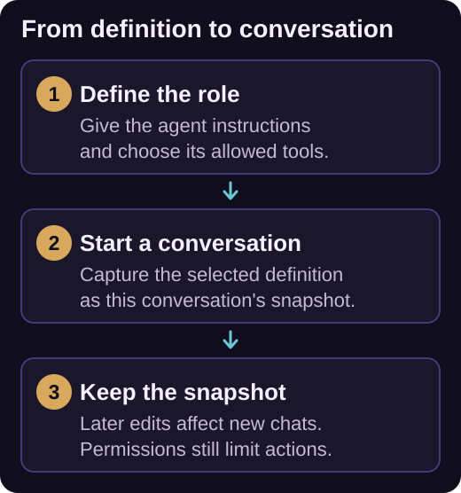

# Custom agents

A custom agent combines a reusable role, instructions, and a tool selection. Create one for tasks such as reviewing changes, explaining an unfamiliar codebase, or implementing changes under your team's conventions.

Agents appear beside **Agent** and **Plan** in the chat's agent selector. An agent definition describes a role; [parallel workspaces](../guide/parallel-workspaces.md) provide separate checkouts for tasks that need file isolation.



*Each new conversation captures the selected agent definition. Later edits do not rewrite that conversation's role or tool selection.*

## Create an agent from chat

1. Open the agent selector and choose **Create agent**.
2. In the guided conversation, choose **workspace** or **global**, describe the mission, and choose all tools, selected tools, or no tools.
3. For selected tools, identify the capabilities the agent needs. If it needs managed command execution, specify the integration read/write rights too.
4. Review the generated `.agent.md` file and select the new agent for a new conversation.

Workspace definitions live in `.github/agents/*.agent.md` and can be committed with the repository. Global definitions live in `%LOCALAPPDATA%\Iolys\agents`. A workspace definition takes precedence when a global definition uses the same logical key.

## Example: a code reviewer

Save this as `.github/agents/code-review.agent.md`:

```markdown
---
name: Code review
description: Review the current changes and report actionable defects without editing files.
tools:
  - read_file
  - search_files
  - grep
  - get_errors
  - run_cli
integrations:
  git:
    read: true
    write: false
---

Review the changes against their intended behavior.
Read related code before reporting a defect.
Prioritize correctness, compatibility, and missing error handling.

For each finding, explain the trigger, user impact, and file location.
Report only actionable findings supported by the code.
Do not modify files, commit changes, or publish review comments.
```

The filename supplies the logical key. Frontmatter supplies the display name, description, and tool access; the Markdown body supplies the system prompt. Use a short descriptive name and a required one-line description. Names are limited to 80 characters, descriptions to 240, and the prompt to 32 KiB of UTF-8 text. `Agent` and `Plan` are reserved names.

## Understand tool selections

| Definition | Meaning |
| --- | --- |
| `tools: []` | No extension-managed tools. |
| An explicit list | Only the listed tool identities, subject to availability and permissions. |
| `tools: ["*"]` or an omitted `tools` field | All current and future extension-managed tools. |
| `server-id/tool-name` | One tool from the MCP server with that stable ID. |
| `server-id/*` | Every tool exposed by that MCP server, including tools added later. |

Use identifiers from the [tool catalog](../reference/tools.md) or the connected [MCP server](mcp.md). An explicit agent using `run_cli` also needs `integrations` rights: omitted rights are false. `run_cli` confines execution to managed integrations; `shell_command` additionally allows ordinary scripts through its separate approval flow.

## Edit and select deliberately

Edit file-backed definitions at their workspace or global location. The selector supports searching and deleting custom agents and reports tools that are missing, disabled, or unavailable.

The conversation captures an agent snapshot when it starts. Editing or deleting the reusable definition does not silently rewrite existing conversations; start a new conversation to use the updated definition.

Agent selections cannot increase [permission](permissions.md) access or bypass disabled tools. Some provider-native tools, notably those retained by Codex, Kimi, and Kiro, cannot be individually disabled by iolys. An explicit workspace-tool list is therefore not a complete restriction on every capability of those providers.
