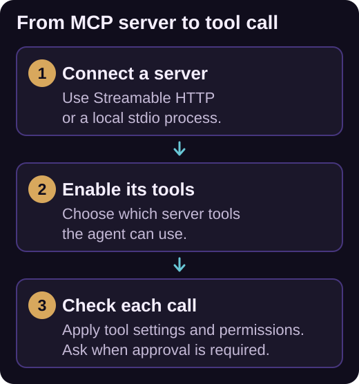

# MCP servers

Model Context Protocol (MCP) connects iolys to additional tools, such as a documentation service, issue tracker, or database integration. Configure a server once and its enabled tools become available to selected [models with tool support](../providers/index.md).

*Connecting a server makes its tools available for selection. Every call remains subject to tool settings, agent restrictions, and permissions.*

## Add a custom server

1. Open **Tools and Skills**, select **Tools**, then **+ > Add custom MCP server**.
2. Choose the **Connection type**: **Streamable HTTP** or **stdio**.
3. For HTTP, enter the **Server URL**. Remote endpoints must use HTTPS; plain HTTP is accepted only for loopback addresses.
4. For stdio, enter the executable in **Command** and each argument on its own line in **Arguments (one per line)**. The required executable must be installed.
5. Choose a **Destination**: **Solution** for the current solution or **Global** for all solutions.
6. Expand **Advanced options** to set a stable server identifier, environment variables, or **Enabled on save**.
7. Select **Test connection**, check the result, and **Save**.

A failed test can still be saved, but the server is saved off with its diagnostic visible. New HTTP configurations use Streamable HTTP; legacy HTTP+SSE is not the supported setup path.

For an HTTP endpoint requiring a bearer token, set `MCP_AUTHORIZATION` to the complete authorization value, such as `Bearer <token>`. Follow the server's authentication requirements and use its complete MCP endpoint, rather than its website address.

## Browse a registry

Choose **+ > Add from MCP registry** to open **MCP Server Manager**. The **Browse** tab searches the selected registry; GitHub MCP Registry is included by default.

Select a server, inspect its URL or command, complete required fields, choose its destination, and select **Install**. Registry entries can offer Streamable HTTP, npm through `npx`, or PyPI through `uvx`; local package options need the relevant runtime. Unsupported transports or incomplete options display a reason.

The **Installed** tab includes both manual configurations and registry installations. **Manage registries...** lets you configure additional compatible registry sources.

## Control server and tool access

Expand a server under **MCP servers** to enable or disable individual tools. Its actions menu offers **Configure**, **Restart**, **Remove**, and **Edit**. **Edit** opens the owning `mcp_servers.json`; **Configure** opens the connection and tool interface.

Each server has its own execution policy:

| Policy | Behavior |
| --- | --- |
| Ask before running all tools | Requests approval; the default. |
| Run all tools automatically | Saves automatic execution for this server. |
| Run all tools automatically (this session only) | Applies the automatic grant to the current session. |

These policies remain subject to [chat permissions](permissions.md), tool enablement, agent restrictions, and chat mode. The server's **Resources**, **Prompts**, and **Instructions** tabs expose reference material; these are not silently converted into tools or merged into iolys instructions.

## Share configuration and troubleshoot

Global servers are stored in `%LOCALAPPDATA%\Iolys\mcp_servers.json`. Solution servers use `<solution-root>\mcp_servers.json`. If scopes contain the same stable ID, solution settings take precedence over workspace settings, then user settings.

Stored environment values are protected with Windows DPAPI and tied to the Windows user. For a shared solution configuration, arrange credentials locally for each developer. When editing, leaving an existing stored environment value blank preserves it; `NAME=` removes it.

For **Error**, open **Configure**, correct the diagnostic, and reconnect. **Cached** means the last catalog is visible but execution needs a live connection. **Unsupported** means the selected model cannot receive these tool definitions. Check the endpoint, executable, credentials, and runtime before retrying.
