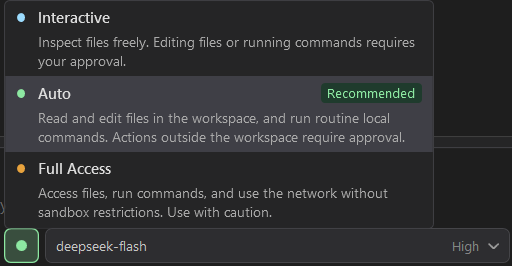

# Permissions

The permission selector controls how much an agent can do automatically. Start with **Auto** for routine development, or **Interactive** when you want to approve edits and command execution as they arise. Review the requested action and its target before granting broader access.

*Choose an approval mode from the chat toolbar. Tool-specific blocks and mandatory confirmations still apply.*

## Choose a permission mode

Open the permission selector in the chat toolbar. A selection before a conversation sets the default for new sessions; changing it in an active conversation applies to that session.

| Mode | Everyday behavior |
| --- | --- |
| **Interactive** | Inspect workspace files freely; approve file edits and ordinary shell commands. |
| **Auto** | Allow workspace inspection and edits automatically. Routine recognized commands can run automatically; broader actions may still need approval. |
| **Full Access** | Permit ordinary file, command, and network operations with fewer restrictions. Tool-specific blocks and mandatory confirmations still apply. |

The compact selector may display **Ask** for Interactive or **Full** for Full Access.

Approvals depend on the operation, not just the selected mode. For example, the dedicated **Run build** and **Run tests** tools do not use the generic Interactive writing-tool confirmation. Ordinary shell scripts in Auto can require an execution grant. Sensitive managed Git/GitHub operations may always request confirmation, even in Full Access.

## Keep mode and permissions separate

**Agent** and **Plan** determine which tools can be used. Permission modes determine which eligible operations need approval.

Plan disables ordinary file editing, deletion, custom-agent/skill creation, and unrestricted shell scripts. Recognized managed CLI reads remain available. Planning tools, builds, and tests can also run in Plan; these may produce plan files or build/test artifacts. Treat Plan as an investigation workflow, not an operating-system sandbox or a guarantee of zero filesystem changes.

Tool-specific workspace boundaries still apply. Some file tools can request access outside the workspace; others reject such paths. Enabling Full Access does not make every tool accept every path.

## Manage command integration rights

Open **Tools and Skills > Tools**, then expand **Run CLI commands > Integrations**. Depending on the integration, choose:

- **Read:** **Allow**, **Always ask**, or **Block**.
- **Write:** **Follow policy**, **Always ask**, or **Block**.

These per-chat overrides persist across reconnects and provider switches. **Always ask** and **Block** remain effective in Full Access. A disabled parent tool or restrictive [custom agent](agents.md) still limits access.

The controls apply to managed direct invocations through `run_cli` and recognized invocations through `shell_command`. They do not turn arbitrary shell scripts into a constrained execution environment.

## Review and revoke grants

Approval prompts can offer one-time or session permissions according to the action. Review the scope before choosing. The permission selector shows session grants and lets you revoke them for that conversation. Revoking a grant affects future operations; it does not cancel an operation already running.

[MCP servers](mcp.md) have separate per-server execution policies, including a session-only automatic option. Enabling a server or a tool is separate from approving its execution.

Use the visible tool calls and [change review](../guide/chat.md) to inspect results. Cancellation stops active work where supported; it does not automatically undo completed changes or retract external actions.
