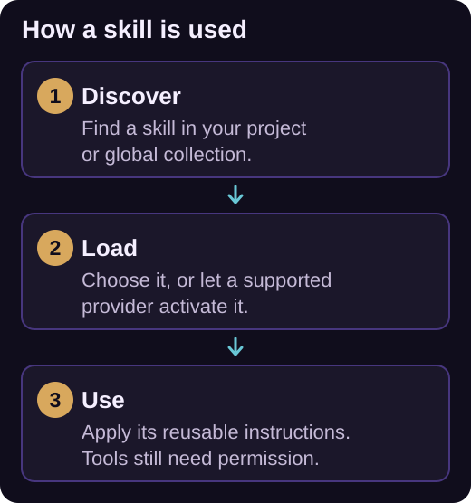

# Agent skills

A skill packages instructions for a repeatable task, together with any reference files, scripts, or assets it needs. Use skills for workflows such as reviewing a migration, writing release notes, or applying your team's testing conventions. Skills can travel with your repository and work across [providers](../providers/index.md).



*Skills provide reusable instructions when needed. Loading a skill does not grant permission to run its tools or scripts.*

## Create or import a skill

The recommended way to create a skill is to use the built-in **skill-creator** skill.

1. Open **Tools and Skills** in the chat toolbar and select **Skills**.
2. Find **skill-creator** in **Built-in** and choose **Use skill** to insert its invocation into the chat.
3. Describe the task, when the new skill should apply, and whether it belongs to the workspace or your global collection, then send the message.
4. Review the created skill with **Open SKILL.md** or **Open folder** in its actions menu.

To reuse an existing skill, select **+**, choose **Import local folder**, and select its folder containing `SKILL.md`.

Workspace skills live at the nearest Git repository root:

```text
.agents/skills/review-migration/
├── SKILL.md
└── references/
    └── database-conventions.md
```

Without a Git repository, iolys uses the effective working directory. Global skills live under `%LOCALAPPDATA%\Iolys\skills`. The picker separates **Workspace**, **Global**, and **Built-in** skills. A valid workspace skill takes precedence over a global or built-in skill with the same name.

## Write a portable manifest

Use this example to understand the manifest generated by **skill-creator** or to edit `.agents/skills/review-migration/SKILL.md` manually:

```markdown
---
name: review-migration
description: Review database migrations for data loss and rollout risks. Use when a task changes a database schema.
---

# Review a database migration

Read the migration and the relevant application code.
Read references/database-conventions.md when it exists.

Check data preservation, nullable changes, defaults, indexes,
and compatibility with the previous application version.

Report each concrete risk with its file location and a suggested fix.
Do not apply the migration or change files during a review.
```

Both `name` and `description` are required. The name must match its folder and contain 1–64 lowercase ASCII letters, digits, or single hyphens. Leading, trailing, or consecutive hyphens are invalid. Descriptions have a 1,024-character limit. Optional portable fields include `license`, `compatibility`, and string-valued `metadata`.

Keep the main instructions focused. Put long examples in `references/`, executable helpers in `scripts/`, and supporting files in `assets/`. A script still needs the normal [tool permissions](permissions.md); loading a skill does not run it.

## Use a skill in chat

Choose **Use skill** in the picker to insert the provider's supported invocation. Complete the message with the task you want performed, then send it. Slash autocomplete also helps you select available skills.

For extension-managed providers, an explicit invocation can start a message like this:

```text
/skill:review-migration Review the migration in the current changes.
```

Codex displays `/<skill-name>` and also accepts `$<skill-name>`. Native CLI behavior differs, so use the picker when switching providers.

The **Automatic activation** control lets supported providers choose a skill when its description matches the task. **Native** means the provider owns activation. Where activation is disabled, explicit invocation remains the way to request an eligible skill.

## Resolve discovery problems

Look in the **Invalid** section for manifest diagnostics. Check UTF-8 encoding, YAML delimiters, the required fields, and the folder/name match. For Kiro, **Repair Kiro link** can repair its compatibility link; an existing real `.kiro/skills` folder may need manual reconciliation.

Use a [custom agent](agents.md) when you also want a persistent role and a selected set of tools.
