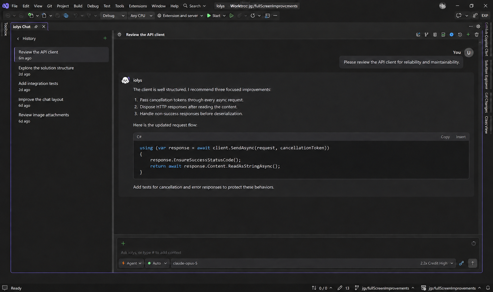
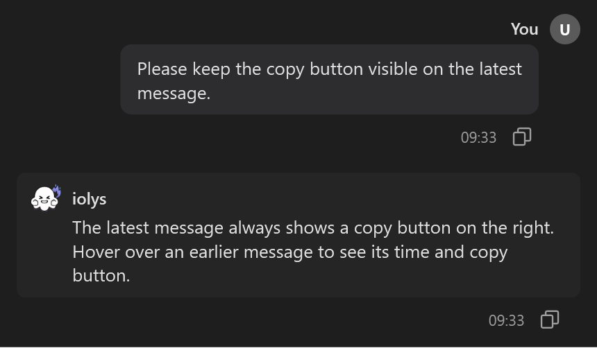

# Conversations and chat

An iolys conversation keeps your requests, replies, and tool activity together for a task. Conversations are associated with the solution and preserved across Visual Studio restarts.

## Start and resume tasks

Select **View > Iolys Chat** to open Chat. Use **New Thread** to start a separate task and **History** to reopen earlier conversations. The task title can be renamed, and tasks you no longer need can be deleted.

*History keeps earlier tasks beside the active conversation. Task names and conversation content are examples.*

Choose the provider and model from the composer. Select **Agent** for implementation or **Plan** for investigation and planning. Plan restricts ordinary editing tools; builds, tests, and provider-native tools have additional rules described in [Permissions](../customization/permissions.md#keep-mode-and-permissions-separate). A [custom agent](../customization/agents.md) can provide a reusable role and tool selection.

Press **Enter** to send a message and **Shift+Enter** to insert a line break. Use **Stop generating** to cancel the active response. Cancellation does not undo changes already applied; use the [review controls](review.md) to inspect them.

## Send follow-ups while the agent works

You can submit another message while a turn is active. Queued messages appear above the composer and run after the current message.

The queue provides controls to:

- Reorder messages by dragging them or using the up and down buttons.
- Edit a queued message when the current draft and draft context attachments are empty.
- Delete a queued message, with an undo action for a removal.
- Retry a message when its queue entry offers **Retry**.
- Send a queued message as guidance to the active turn with **Steer**, when available.

Use a follow-up for the next task step. Use steering for a correction that matters to work already in progress, such as “Preserve the existing method signature.” Context attached to the queued message stays with it during queue operations.

## Read long conversations comfortably

Select **Read in document area** in the toolbar to give Chat the same space as a code editor. The composer, attachments, model picker, and tools remain usable. Press **Escape** or select **Exit reading mode** to restore the previous panel placement.

Hold **Ctrl** while scrolling over the conversation to zoom from 75% to 200%. With keyboard focus in the conversation, use **Ctrl+Plus**, **Ctrl+Minus**, and **Ctrl+0** to adjust or reset zoom. Zoom preferences are saved locally.

Scrolling up pauses automatic following so you can read earlier messages. Returning to the bottom or sending a message resumes following new content. The chevron beside **Changes** collapses its file list without dismissing the changes.

## Copy a message

Select **Copy message** beside a reply or your own message to copy its text. The latest message keeps its copy button visible; hover over an earlier message to reveal its time and copy action.

*The copy action belongs to the individual message. This example shows the earlier message while hovered.*

## Continue with a handoff

Use a handoff when a new conversation needs the current discussion:

1. Wait for the active turn to finish.
2. Open **Settings > Save handoff**. iolys writes a readable `context_handoff.md` file and reports its location.
3. Choose **Settings > Load handoff** and select the file.
4. Review the new conversation's draft, add your next request, and send it.

Loading starts a new conversation and places the handoff in the composer; it does not send automatically. Saving uses the same filename, so preserve an earlier handoff under another name if you need both. The file contains conversation text: review it before sharing or committing it.

## Use the companion web interface

Select **View > Iolys Web** to open the companion local web interface. Choose the connected Visual Studio instance, then open or create a task. It shares conversation state with the local server and supports streamed replies, model selection, permissions, clarification prompts, and cancellation.
