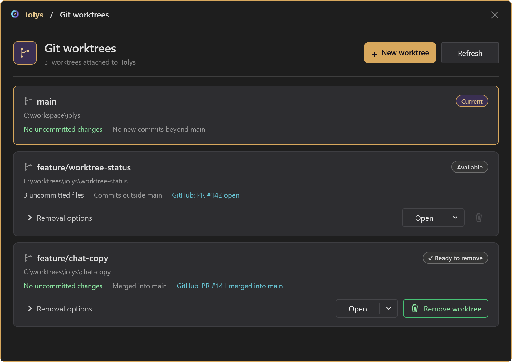

# Work in parallel

iolys can create a separate workspace and Git branch for an independent task, then open it in another Visual Studio instance. Each task gets its own files and build state, so two agents can work at the same time without editing the same checkout.

This uses **Git worktrees**. You need Git and an open solution in a Git repository.

## Create an isolated task

1. In Chat, select **Create a Git worktree** from the worktree control.
2. Enter a **Worktree branch**, such as `feature/search-filter`.
3. If needed, expand **Advanced options** and choose the **Default worktree root**.
4. Select **Create**.
5. In the new Visual Studio instance, open iolys Chat and describe the task.

A new branch starts from the current repository's **HEAD**. Uncommitted edits in your original checkout are not part of that commit. Commit the required starting changes first if the new task needs them.

If the branch already exists locally, iolys asks whether to use it. An existing branch starts from its own state. Git's checkout restrictions still apply; a branch already in use by another worktree cannot simply be checked out again.

## Give each task a clear boundary

Good parallel tasks have independent outcomes. For example, one workspace can implement an export command while another investigates a slow test suite.

```text
Add a CSV export command for the results grid. Keep changes limited to the
export workflow and its tests. Do not alter search or filtering behavior.
```

Use the regular [review workflow](review.md) in each workspace. Isolation separates files, but integrating two branches can still produce merge conflicts when both changes affect the same code.

## Find and reopen workspaces

Select **View Git worktrees**, or **View all worktrees** from the creation dialog. The window shows each branch and folder, local changes, merge information, and GitHub pull request status when available.



*Illustrative branches, paths, and pull requests. Check local changes and merge status before removing a workspace.*

**Open** loads a worktree in the current Visual Studio instance. Its dropdown also offers opening it in a new window. Use **Refresh** to update the list and status checks.

Git merge status is based on commit ancestry. Squash or rebase merges can require the pull request status to establish that work was merged. Read any cached or unavailable status as such, rather than assuming a live check succeeded.

## Clean up completed work

After reviewing and integrating the work:

1. Commit or otherwise preserve any changes you need.
2. Close the task's Visual Studio instance and return to another workspace.
3. Open **View Git worktrees** and refresh its status.
4. Use the removal action for the completed workspace and review the confirmation.

The current worktree and main worktree are protected from removal in this interface. Ordinary removal requires verified clean local state. A **Ready to remove** status identifies clean work that is recognized as merged.

Under **Removal options**, **Force** allows removal despite uncommitted changes, which can discard work. **Delete branch** separately deletes the local branch and asks for confirmation because unmerged commits can be lost. Leave these options off unless their effects match your intent.
