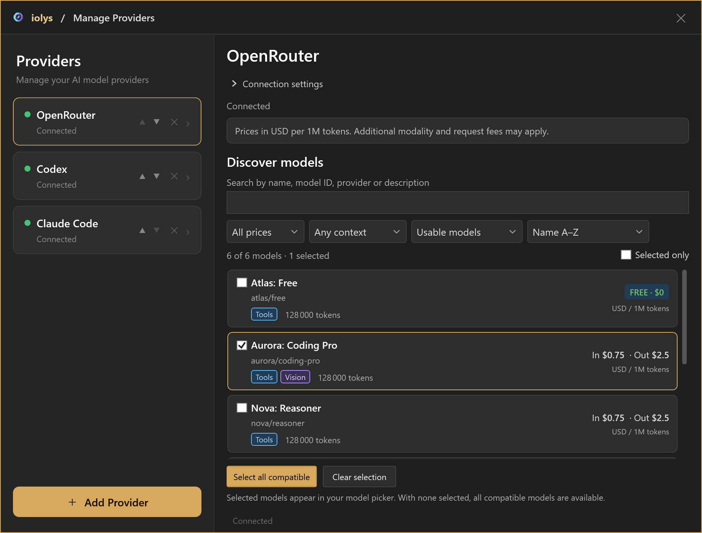

# Settings and model controls

The composer holds choices for the current conversation. The **Settings** button in the chat toolbar opens provider management, integrations, presentation preferences, and conversation actions.

## Choose a provider and model

Open the model picker to search available models. Select **Manage Models** there, or **Settings > Manage Providers**, to configure accounts, endpoints, and managed CLIs.

Use the provider's setup page to install or update its supported CLI, complete authentication, or enter API settings. Return to the picker after configuration. Indicators such as **Vision**, **Thinking**, or **Web** describe advertised model capabilities; the tools actually available also depend on the provider and your configuration.

Use [Providers](../providers/index.md) to compare connection routes and find their individual setup instructions.

*Provider management with illustrative model names and prices. Each provider presents the controls it supports.*

## Set reasoning effort and speed

Reasoning effort appears only when the selected model offers supported levels. Select one of the values shown for that model. The list is provider-specific: a level available on one model may disappear when you switch to another.

A missing reasoning selector does not by itself mean setup failed. Some providers do not expose this control, and some models expose thinking without graded effort levels.

Where supported, the picker also offers **Speed** or **Fast mode**. Accelerated service can carry increased usage. Speed is a conversation choice and new sessions start in standard mode. If a provider rejects the requested tier, iolys reports the failure and returns the next turn to standard; it does not automatically replay a potentially partially executed request.

## Choose mode, permissions, and tools

| Control | What it changes |
| --- | --- |
| **Agent / Plan** | Whether the task can implement changes or is restricted to investigation and planning. |
| [Custom agent](../customization/agents.md) | A reusable role, prompt, and allowed tool selection. |
| [Permissions](../customization/permissions.md) | When operations require approval and the access available to the task. |
| [Tool picker](../customization/tools.md) | The enabled built-in, native, skill, and external MCP capabilities. |

These controls work together. Selecting a custom agent or enabling a tool does not bypass a permission request or a Plan-mode restriction.

*Choose the permission level separately from the model and Agent or Plan mode.*

For credential storage and automatic iolys backend reporting, see [Data and privacy](../reference/privacy.md). Chat permissions govern agent actions; they do not configure analytics or external services' retention policies.

## Connect GitHub

Open **Settings > GitHub** under **Integrations**. Choose the host, install the managed CLI if prompted, and select **Connect an account in the browser**. Complete the CLI prompts and the browser approval, then check the active account shown in the window.

The integration provides account and CLI management, including **Refresh**, **Update / repair CLI**, and **Disconnect active account**. An Enterprise host can be added by hostname.

GitHub CLI authentication can be shared with your personal CLI under the same Windows user. Login, account switching, and disconnection may affect that account too. Disconnecting removes local authentication; use **GitHub application settings** to manage the remote application's access.

## Adjust the chat experience

In **Settings**, turn **Notification sound** on or off. It signals that a response is ready or input is needed. Use **Take the toolbar tour** to revisit the interface and **What's New** to open release information.

For reading space and text size, use [document-area reading mode and zoom](chat.md#read-long-conversations-comfortably). For conversation actions, see [handoffs](chat.md#continue-with-a-handoff) and [rollback](review.md#roll-back-the-tracked-group).
