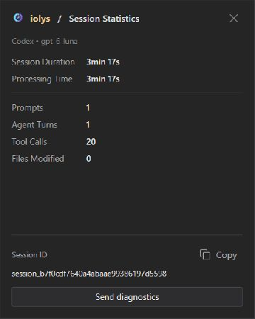

# Usage and session statistics

iolys exposes several kinds of usage information. They answer different questions, so a low context percentage does not mean you have plenty of account quota remaining, and a missing cost estimate does not mean a request was free.

| View | What it helps you understand |
| --- | --- |
| **Context window usage** | How much information occupies the selected model's conversation context. |
| **Show usage** | Provider-reported account limits, quota consumption, credits, or reset times. |
| **Session statistics** | Activity and timing for the current task, plus available cost or credit estimates. |

## Inspect context capacity

Select **Context window usage** beside the composer. The window shows the available total and a breakdown into categories such as messages, files, tools, and system instructions. Expand categories to inspect their details.

The data depends on the provider and the available server snapshot. Read the explanatory text in the window: an estimate or a message saying no snapshot is available should not be treated as an exact provider measurement. For image-capable models, image accounting can also differ from text token estimates.

*Example context breakdown. The note below the categories explains which values are estimated.*

When a task has accumulated unrelated material, start a new conversation and supply the relevant files or a concise summary. [Handoffs](chat.md#continue-with-a-handoff) can transfer a discussion to a new task, but a full transcript handoff still carries text; it is not automatic context compression.

## Check provider quotas

Select **Show usage** in the chat toolbar. This button is shown when the selected provider supports usage reporting.

Depending on the provider, the window can show percentages, used and remaining capacity, reset dates, credits, or account-specific limits. For example, Claude Code can report 5-hour and 7-day subscription quotas, model-specific weekly limits, and enabled extra usage when those values are available.

*Illustrative Claude Code quotas and dates. Available rows depend on the account and provider.*

These limits belong to the provider account. Other clients using the same account may contribute to them. Consult the matching [provider guide](../providers/index.md) for its setup and supported reporting.

Some providers expose a **Use reset** action when the account has an eligible reset available. That action changes the provider's quota state; it is not merely a refresh button. Read the displayed reset details before using it.

## Inspect a task's activity

Open **Session statistics** from the toolbar. The view identifies the provider and model and can include:

- Session duration and model-processing time.
- Prompt and agent-turn counts.
- Tool-call and modified-file counts.
- Estimated cost, estimated credits, and average credits per turn when supported.

Session duration and processing time measure different parts of the workflow. A conversation can remain open while no model request is running.

*An example session's statistics. Counts describe that conversation, while provider quotas describe account usage.*

The window also provides the session ID and **Send diagnostics** for support. See [Troubleshooting](troubleshooting.md#send-a-diagnostic-report) before submitting a report.

## Interpret estimates carefully

Model prices shown in the picker are list prices where available. Estimates depend on the usage and pricing information returned by the provider and may not reflect every discount, cache policy, subscription rule, or later billing adjustment. Use the provider's account dashboard for its billing record.

Reasoning effort and optional speed tiers can change resource use. Choose these controls for the task at hand and inspect the provider's own notices; see [Settings and model controls](settings.md).
