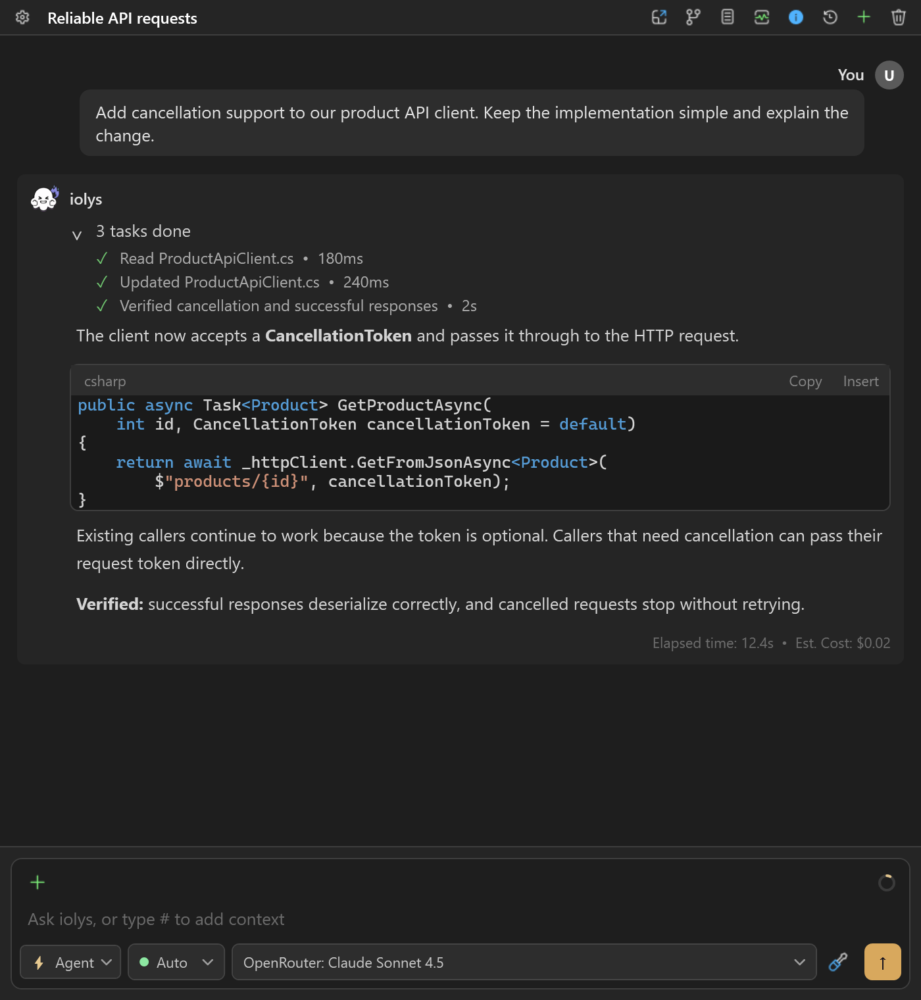

THE IOLYS DOCUMENTATION

# Your AI workspace. Inside Visual Studio.

Connect your preferred models, give them the right context, and move from a question to a reviewed change. One familiar workflow, across AI providers.

<a class="doc-button" href="guide/installation.md">Install iolys →</a>
<a class="text-action" href="guide/quickstart.md">Run your first task ↗</a>

 For Visual Studio on Windows / Currently in beta

## Start here

Choose a starting point. Each guide takes you through the controls you will use in iolys.

<a class="route-card" href="providers/index.md">↔<strong>Connect a provider</strong>Use a coding subscription, an API key, or a local model.Find your setup →</a>
<a class="route-card" href="guide/quickstart.md">⌘<strong>Make your first change</strong>Open a solution, describe a task, and review the result.Follow the quickstart →</a>
<a class="route-card" href="customization/permissions.md">◇<strong>Stay in control</strong>Choose a mode and decide what your agent can do.Understand permissions →</a>
<a class="route-card" href="customization/skills.md">✳<strong>Make it your workflow</strong>Reuse skills, create custom agents, and connect MCP tools.Explore Agent Skills →</a>

## What is iolys?

iolys is an AI development workspace for Visual Studio. It connects your solution, models, conversations, and development tools in one interface. You bring a provider account, API credentials, or a local model; iolys supplies the workflow around it.

An agent can inspect project files, explain code, propose a plan, make changes, and use Visual Studio's build and test tools. The available actions depend on the model, enabled tools, selected mode, and permissions.

<figure class="product-figure">

<figcaption>A task, its tool activity, and your next message in the same workspace. Screenshots illustrate the interface; models and controls can vary by version.</figcaption>
</figure>

## Choose your workflow

| If you want to… | Start with… |
| --- | --- |
| Use Claude Code, Codex, Kimi, or Kiro | [Managed CLI providers](providers/index.md#choose-a-connection) |
| Connect hosted models or your own endpoint | [API providers](providers/api-providers.md) |
| Use local or remote Ollama models | [Ollama](providers/ollama.md) |
| Ask about a file, selection, or screenshot | [Files, images, and context](guide/context.md) |
| Work on several tasks independently | [Parallel workspaces](guide/parallel-workspaces.md) |
| Review an agent's edits | [Review and undo changes](guide/review.md) |
| Understand usage, quotas, and estimates | [Usage and costs](guide/usage.md) |

## Build on your team's conventions

Package a repeatable process as an [Agent Skill](customization/skills.md), give a specialized role its own [custom agent](customization/agents.md), or add external capabilities through [MCP servers](customization/mcp.md). These features work within the permissions you choose.

Read [Data and privacy](reference/privacy.md) to understand provider requests, locally saved conversations, product analytics, and optional diagnostics.

## Get help

Start with [Troubleshooting](guide/troubleshooting.md) for connection, model, tool, and session issues. For questions and feedback, join the [iolys Discord community](https://discord.com/invite/NMnFZmPsc5). Product news and release articles are available on the [iolys website](https://getiolys.com/).
