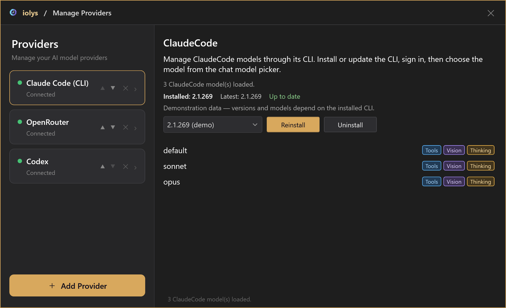
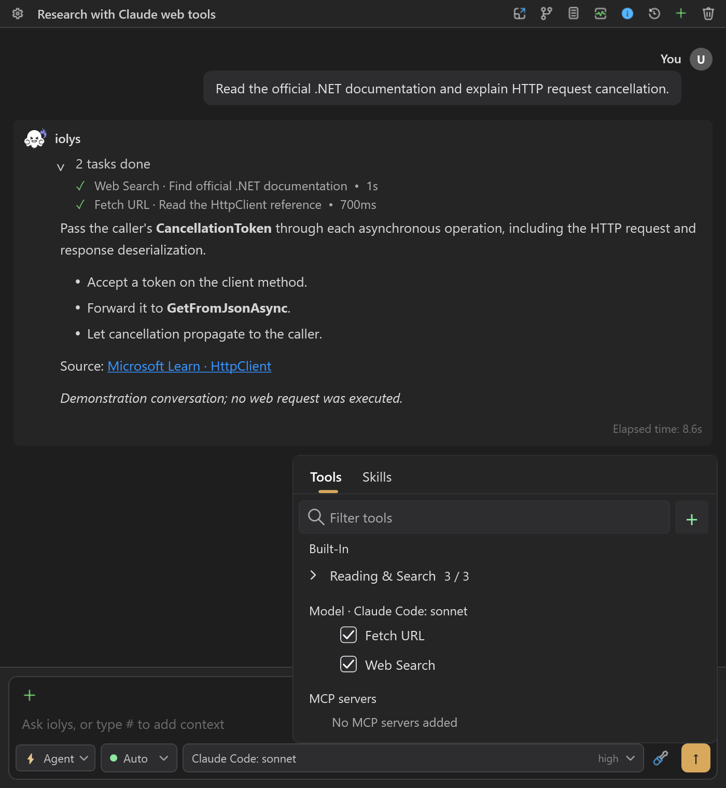
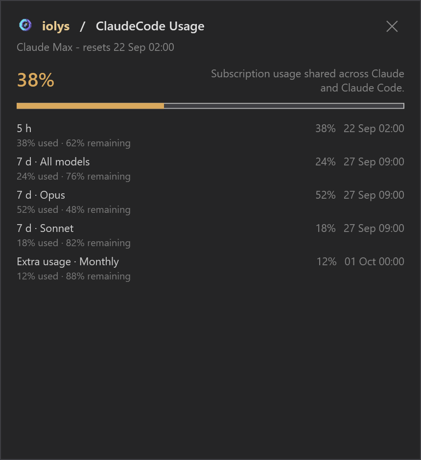

# Claude Code

Use **Claude Code (CLI)** to connect a Claude subscription to iolys. The managed CLI handles Claude authentication and conversation state; iolys supplies the Visual Studio interface and development tools. For an Anthropic API key, use the separate [Anthropic API connection](api-providers.md#anthropic).

## Set up Claude Code

1. Open **Manage Models**, select **Add Provider**, and choose **Claude Code (CLI)**.
2. Install the CLI using the provider's version controls.
3. Complete browser sign-in with the Claude account you intend to use when prompted. If the provider is disconnected, select **Connect** to open sign-in.
4. Wait for the model catalog, then select a Claude Code model in the conversation picker.
5. Choose the available reasoning effort, [tools](../customization/tools.md), and [permissions](../customization/permissions.md), then send a message.

The managed connection requires Claude account authentication. A separate personal CLI login or Anthropic Console API login does not establish this connection. Subscription eligibility and model access depend on your Claude account.

*Illustrative model catalog.*

## Work with Claude

Responses, reported thinking, and tool activity stream into Chat. Returning to a saved conversation resumes its Claude session when that session is available. Changing the model or effort keeps the session.

Use the model picker for effort choices advertised by the CLI. A Thinking badge does not guarantee a visible thinking block on every response.

Attach PNG, JPEG, GIF, or WebP images up to **5 MiB per attachment**. An unreadable, unsupported, missing, or oversized attachment blocks the message before it is sent. The provider can apply additional restrictions.

## Tools and skills

Claude Code uses shared iolys workspace tools and configured [MCP tools](../customization/mcp.md). **Web Search** and **Fetch URL** are native Claude tools and can each be disabled under **Model Tools**. Other native Claude tools are outside this integration's allowlist; file and shell operations use iolys tools and permissions.

*Enable Claude's web tools individually. The conversation and completed calls are demonstration data.*

Shared project [skills](../customization/skills.md) are supported. This provider also discovers project `.claude/skills` directories. Loading a skill does not enable Claude-specific hooks, shell interpolation, or native skill permission overrides. The shared iolys permission rules still apply.

## Usage and maintenance

Open **Usage** for reported subscription quota windows, percentages, reset times, and additional model limits when available. iolys does not show a Claude Code per-turn dollar charge. Context usage is an estimate based on the most recent response, including reported cache tokens.

*Compare quota windows and their resets. Plan details and percentages shown here are illustrative.*

Use the provider panel to update, reinstall, or switch to a listed CLI version. **Uninstall removes the managed authentication and Claude session files.** A remaining iolys transcript does not recreate deleted Claude context. Disconnecting is a separate action and does not uninstall the CLI.

## Troubleshooting

| Problem | Action |
| --- | --- |
| A personal Claude installation works, but iolys does not connect | Install and sign in through the iolys provider panel. |
| No models appear | Check sign-in, reconnect, and verify the managed CLI version. |
| Usage is unavailable | Check account authentication and update the managed CLI; usage depends on CLI support. |
| An image message fails | Check every attachment's format, readability, and 5 MiB limit. |
| A resumed session is missing | Follow the recovery prompt or start a new task with the context it needs. |

Continue with [your first task](../guide/quickstart.md) or [usage and context](../guide/usage.md).
