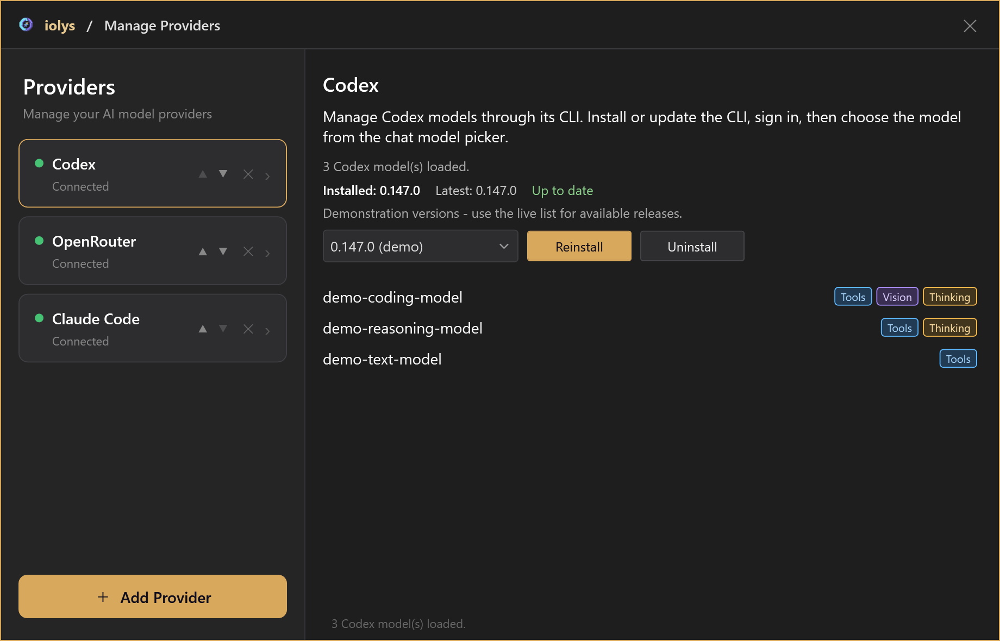
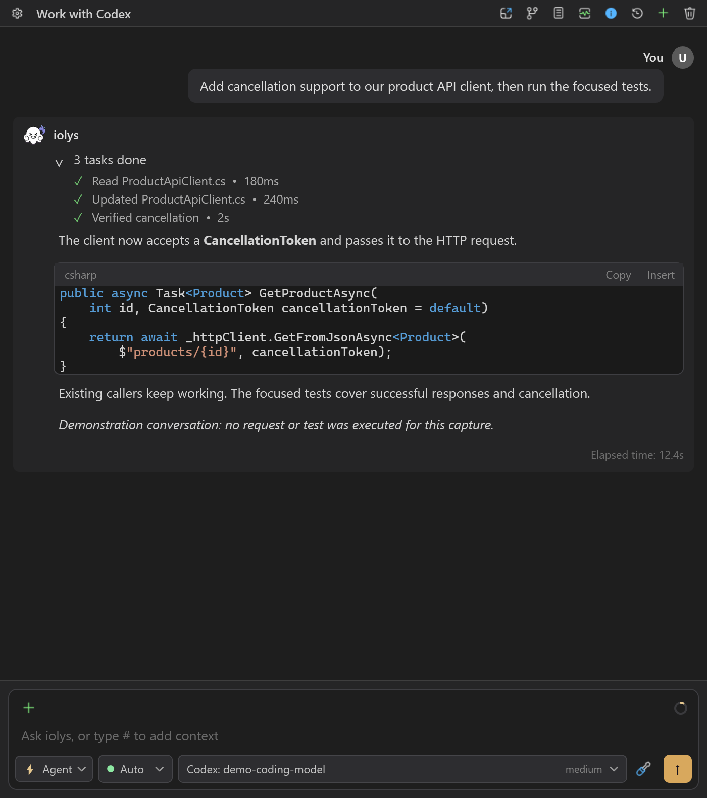
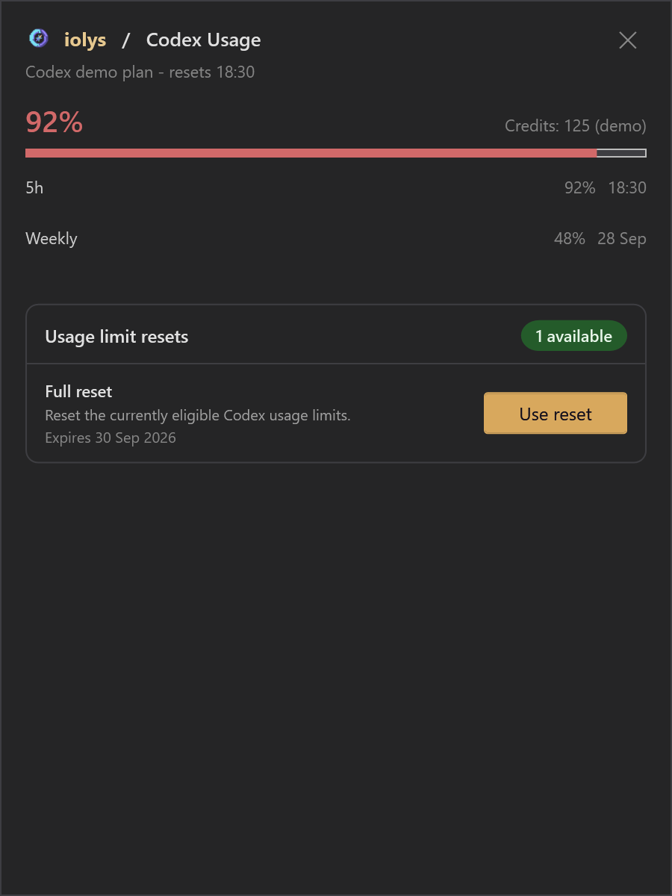

# Use OpenAI Codex for C# in Visual Studio 2026

Work on your C# projects with OpenAI Codex directly inside Visual Studio 2026 using iolys. The Codex provider runs an iolys-managed Codex CLI. You can work with Codex models, workspace tools, images, and saved conversations from the shared iolys interface.

<a class="doc-button" href="https://marketplace.visualstudio.com/items?itemName=iolys.iolys-visual-studio">Install iolys for Visual Studio →</a>

## Set up Codex

1. Open **Manage Models**, select **Add Provider**, and choose **Codex**.
2. Install a CLI version using the provider panel.
3. Complete interactive sign-in when prompted. If the provider is disconnected, select **Connect** to open sign-in.
4. Wait for **Connected** and the discovered model list.
5. Return to Chat and choose a Codex model.

iolys uses a dedicated executable, profile, configuration, and session directory. Signing in through another Codex application does not sign in this managed profile. The panel provides the interactive login flow rather than an API-key field; for a direct OpenAI API connection, see [API providers](api-providers.md#openai).

*Illustrative model catalog and versions.*

## Choose effort and speed

Available reasoning efforts and speed tiers come from the selected model's catalog. When an effort choice is needed, iolys prefers `medium` if the model advertises it. Changing models can change the available choices.

New conversations use standard speed. Additional speed tiers appear only when advertised. If a tier is rejected, the turn fails and standard speed is restored for the next turn; iolys does not automatically replay work that may already have changed files. Speed controls do not quote a price or quota impact.

## Tools, images, and sessions

Codex streams responses and tool activity into Chat. You can cancel work, resume saved sessions, and send instructions during an active turn when steering is available.

*Tool progress appears above the response; model and effort remain visible in the composer. Demonstration conversation.*

Shared [iolys tools](../customization/tools.md) and [MCP tools](../customization/mcp.md) respect the selected agent, mode, and permissions. The integration permits Codex-native Web Search, Generate Image, and Get Goal; actual availability depends on Codex. Native capabilities are not a promise that every wider Codex feature is available in iolys.

Attach images to a model marked **Vision**. Shared project [skills](../customization/skills.md) can be invoked explicitly from the skill picker. Use the controls presented in iolys to configure the current task.

## Context and usage

The context view uses Codex counters when available and estimates its breakdown. iolys can compact context automatically before a new turn when usage reaches its configured threshold. Context size comes from model metadata when available.

Open **Usage** for reported quota windows, reset times, and account credits. These account values can include activity outside this conversation. The Codex adapter does not calculate a dollar cost for each turn. See [usage and context](../guide/usage.md).

*Illustrative quotas and credits. Reset controls appear only when the account reports an eligible reset.*

## Troubleshooting

| Problem | Action |
| --- | --- |
| Codex works elsewhere but is disconnected here | Complete the managed installation and sign-in in iolys. |
| Installation is reported incomplete | Reinstall that version; Codex requires companion executables as well as its main binary. |
| An effort or speed choice disappears | Refresh the catalog and use choices advertised by the current model. |
| No Vision badge appears | Select a model whose catalog explicitly reports image support. |
| A request exceeds account limits | Check Usage and the reported reset time. |

Use the provider panel for version changes and updates. Preserve any context you need before removing managed provider data or recovering a missing session.
