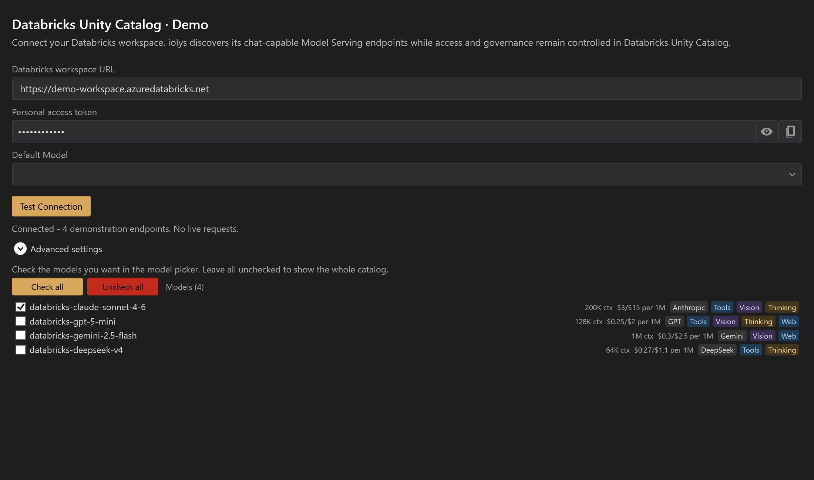
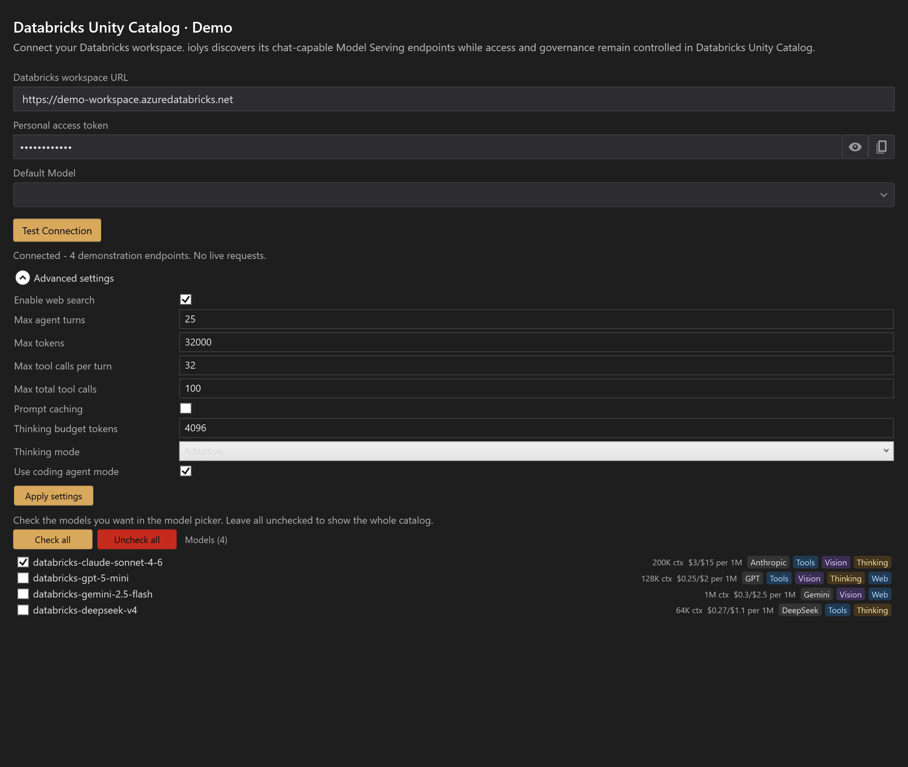

# Databricks

The **Databricks Unity Catalog** provider connects to chat-capable Model Serving endpoints in your Databricks workspace. It supports multiple named instances, each with its own workspace and token. Configuring this provider does not itself grant access to tables or other workspace data.

## Connect your workspace

1. Obtain your Databricks **workspace URL** and a token for that workspace.
2. Confirm that the token can list serving endpoints and query the intended endpoint. Your administrator may need to grant `CAN_QUERY`.
3. Open **Manage Models**, select **Add Provider**, and choose **Databricks Unity Catalog**.
4. Name the instance, enter the workspace URL and **Personal access token**, and select **Create**.
5. Select **Test Connection**, then choose a discovered endpoint as **Default Model**.
6. Check the endpoints you want in the conversation picker, return to Chat, and select one.

Use the HTTPS workspace root, for example `https://example-workspace.azuredatabricks.net`, rather than the account console. Azure, AWS, and GCP workspace hostnames are recognized. Private connectivity still requires the appropriate network, DNS, and VPN access.

*Demonstration workspace and endpoints.*

Existing developer environment variables or a Databricks configuration profile can prefill the form. Check that the token belongs to the displayed workspace. This provider uses the supplied token; it does not acquire or refresh OAuth credentials automatically.

## Select an endpoint

The catalog lists eligible chat endpoints and their available capability metadata. Use the **serving-endpoint name**, rather than an arbitrary underlying model ID. Visible endpoints can still reject requests if their readiness or permissions have changed.

Checkboxes pin endpoints to the model picker. **Check all** selects the catalog; **Uncheck all** clears pins, which exposes the whole catalog. The conversation picker can group endpoints by model family.

**Test Connection** checks discovery; it does not prove that a complete conversation will succeed. Discovery can also make validation requests to determine GPT reasoning options.

## Tools, images, and reasoning

iolys selects the appropriate Anthropic or OpenAI-compatible route for the endpoint. Tool-capable endpoints can use shared [iolys tools](../customization/tools.md), [MCP servers](../customization/mcp.md), and [skills](../customization/skills.md), under normal [permissions](../customization/permissions.md).

**Gemini function calling is currently suppressed by this integration**, even if its catalog row shows Tools. Choose a compatible endpoint with working function-tool support for workspace actions.

Images and reasoning depend on the endpoint. Some missing capability metadata is handled optimistically, so a badge is not always a positive compatibility guarantee. Select available reasoning efforts in the model picker. Anthropic-route thinking, output limits, and prompt caching are available under **Advanced settings**; choose **Apply settings** after editing.

## Native web search

Enable **Enable web search** in **Advanced settings** and apply it to request native search on supported GPT and Gemini endpoints. It defaults to off and has no effect on other families.

This is a provider setting, rather than a Model Tools checkbox. Disabling local tools or choosing a restrictive custom agent does not turn this search setting off. Disable it explicitly when search should not be requested.

*Expand Advanced settings to change web search, then apply the change. Endpoint names, token indicator, and settings are demonstration data.*

## Costs and troubleshooting

Conversation dollar values are approximate estimates from reported token usage and built-in price data. iolys does not provide a Databricks balance, DBU, quota, or billing dashboard.

| Problem | Action |
| --- | --- |
| Workspace URL is rejected | Use a recognized workspace hostname and its HTTPS root. |
| No endpoints appear | Check token scope, endpoint task, readiness, and query permissions. |
| The selected model is unknown | Choose an actual serving-endpoint name from your workspace. |
| Capabilities remain stale after endpoint changes | Restart the iolys server and refresh discovery. |
| Tool use fails on Gemini | Use another endpoint for workspace function tools. |

See [usage and context](../guide/usage.md) for the limits of local estimates.
