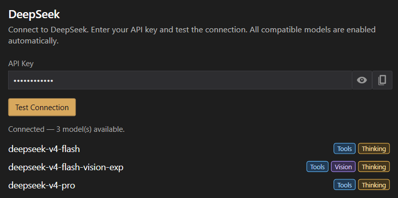
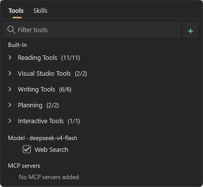
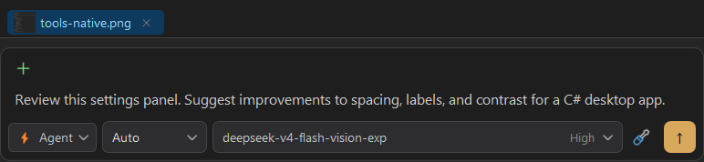

# DeepSeek

Connect the DeepSeek API to use its models with iolys conversations, workspace tools, and native Web Search. This connection uses an API key and your DeepSeek account balance. It does not install a CLI or connect a consumer chat subscription.

## Connect DeepSeek

1. Obtain a key from your [DeepSeek API account](https://platform.deepseek.com/api_keys).
2. Open **Settings > Manage Providers**, or **Manage Models** from the model picker.
3. Select **Add Provider**, choose **DeepSeek**, and enter the API key.
4. Select **Create**. iolys checks the connection while adding the provider.
5. In the resulting DeepSeek panel, use **Test Connection** whenever you need to check updated credentials or refresh the model list.
6. Return to Chat and select a discovered DeepSeek model.

The endpoint is preset to `https://api.deepseek.com`; there is no base-URL field in this provider panel. Compatible models are enabled automatically, so you do not need to pin individual models before chatting.



*Historical interface capture. Model names and availability can change; use your current catalog.*

## Work with your solution

Choose **Agent** to implement a task or **Plan** to investigate it. DeepSeek can use shared [workspace tools](../customization/tools.md), [skills](../customization/skills.md), and connected [MCP tools](../customization/mcp.md), subject to model support, tool selection, and [permissions](../customization/permissions.md).

Start with a concrete request:

```text
Inspect the API client and its tests. Identify missing cancellation handling,
then propose a compatible fix before editing files.
```

Responses and tool activity appear in Chat. [Review the changes](../guide/review.md) and check the reported tests before committing implementation work.

## Choose reasoning effort

Select an effort from the conversation's model controls. The current iolys DeepSeek integration advertises **Low**, **High**, **XHigh**, and **Max**, with High as its model default. Use the choices actually shown in your installed version.

Reasoning settings are validated against the integration's advertised choices before requests are built. Reported thinking can appear separately from the answer. A Thinking badge does not promise a visible thinking block on every response. See [reasoning and model capabilities](reasoning.md) for the shared controls.

## Enable native Web Search

Open **Tools and Skills > Tools** and find **Model · your selected model**. Enable or disable **Web Search** there. It searches the web and reads pages through DeepSeek; there is no separate native Fetch URL checkbox.



Search progress appears in the conversation. Plan permits search, while disabled-tool settings and custom-agent restrictions still apply. An agent with an explicit tool list needs `web_search` in that list to use this native capability.

The catalog does not prove search support for every model. iolys learns support from the first real request with search enabled; listing models and toggling the checkbox do not send an extra capability probe. Those real requests remain subject to normal API billing.

If the endpoint explicitly rejects `web_search` as unsupported, iolys remembers that result for the model and retries once without search. Authentication, insufficient balance, rate limits, and unrelated errors do not disable search. A conversation that has used search can continue using the same request format after search is disabled.

## Attach images

Select a model marked **Vision**, then paste an image or use **+ > Add file...**. Describe what to inspect. The selected model's capabilities govern both image attachments and the shared `read_image` tool; do not assume every DeepSeek model accepts images.



*This historical capture shows an unsent draft, not a generated answer.*

## Check balance and costs

Open **Show usage** for the account's reported available balance and currency. DeepSeek's Usage view is a balance display, not a subscription quota percentage or reset schedule.

Conversation costs, when available, are estimates based on reported token use and iolys's packaged pricing data, including cache information when reported. They can differ from final billing. Use your DeepSeek account for its billing record; see [Usage](../guide/usage.md).

## Troubleshooting

| Problem | Next step |
| --- | --- |
| Authentication failed | Check the API key, then use Test Connection. |
| Insufficient balance | Check Usage and top up the intended DeepSeek account before retrying. |
| Rate limit reached | Reduce concurrent requests or retry later. |
| Search is missing after a rejection | The unsupported result is remembered; try another available model or consult support. |
| An image is rejected | Check the Vision capability, file accessibility, and selected model. |
| Usage is unavailable | Recheck credentials and connectivity; an unavailable balance does not mean zero. |

For reconnect failures or diagnostic reports, see [Troubleshooting](../guide/troubleshooting.md).
