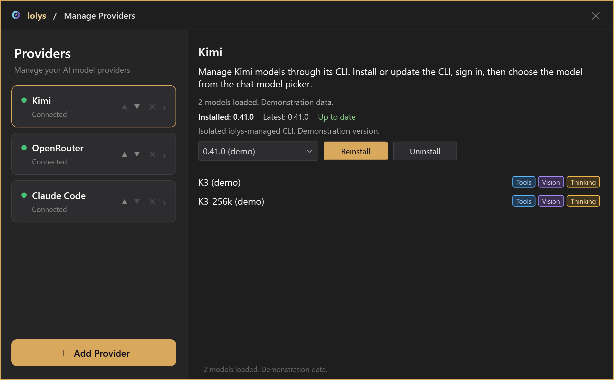
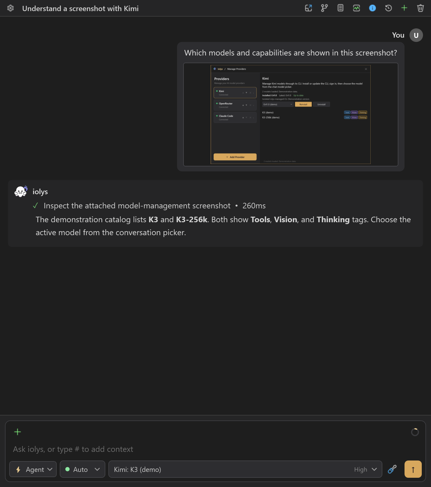
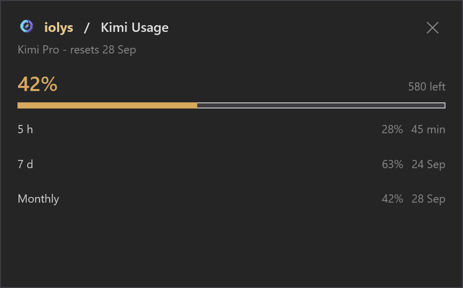

# Kimi

The Kimi provider connects the managed Kimi Code CLI to iolys. It supports streaming conversations, shared development tools, reported thinking, saved sessions, and subscription usage. A Kimi model selected through [OpenRouter](openrouter.md) uses that provider's separate credentials and billing.

## Set up Kimi

1. Open **Manage Models**, select **Add Provider**, and choose **Kimi**.
2. Install the managed CLI using its version controls.
3. Complete browser or device authorization for your Kimi Code account when prompted. If the provider is disconnected, select **Connect** to open sign-in.
4. Wait for the discovered models and their capability tags.
5. Select a Kimi model in Chat, choose an effort if available, and send your request.

iolys maintains its own Kimi executable and profile. It also prepares the private Git Bash runtime needed by the CLI. Your separate terminal installation and login are not automatically reused.

*Illustrative model catalog.*

The iolys panel has no dedicated Kimi API-key or base-URL form. Its subscription Usage reader expects Kimi Code OAuth credentials; other standalone CLI authentication choices may not provide the same usage view.

## Models and reasoning

The catalog supplies Tools, Vision, and Thinking capabilities, context size, and supported effort choices. A model can support thinking without offering adjustable effort levels. Choose only the efforts available in the conversation picker; iolys applies the selection before sending the prompt.

A recent cached model list can appear before a live session has authenticated. Connected status and a populated picker do not guarantee remaining quota or that the next request will succeed.

## Images and tools

For images, choose a **Vision** model and keep the iolys **read_image** tool enabled. Kimi receives an instruction to inspect the attachment through that tool. The file must be accessible to the server, and files outside the workspace can require permission. Restricting the tool in a custom agent can prevent image inspection.

*Kimi inspects attachments through the shared image tool. This screenshot illustrates the workflow with demonstration data.*

Kimi's native **Web Search**, **Fetch URL**, and **Skill** tools are available with this integration and cannot be disabled individually in the session picker. Workspace edits, shell commands, and IDE operations use the shared [iolys tools](../customization/tools.md), subject to [permissions](../customization/permissions.md). Additional tools come from your [MCP configuration](../customization/mcp.md).

## Usage and sessions

Open **Usage** for the reported plan, rolling quota windows, remaining allowance, reset dates, and quota warnings. iolys does not calculate Kimi-specific per-turn dollar costs. The context indicator is an estimate, not a billing report.

*Usage windows are listed separately. The plan, allowance, and percentages are demonstration values.*

Saved sessions resume when the CLI supports loading them and the session still exists. If a fresh CLI session is created, the visible iolys transcript does not establish that the original provider context was restored.

## Troubleshooting

| Problem | Action |
| --- | --- |
| Sign-in or CLI startup fails | Check managed installation progress and retry after any runtime download failure. |
| An image is ignored | Verify Vision support, file access, and that `read_image` is allowed. |
| No effort selector appears | Refresh the catalog; some models do not advertise effort choices. |
| Usage is unavailable | Check Kimi Code sign-in and reconnect. |

Use the provider panel for updates. **Uninstall removes the managed Home, including credentials and CLI sessions.** Disconnecting is a different action and should not be treated as revoking account authorization.
