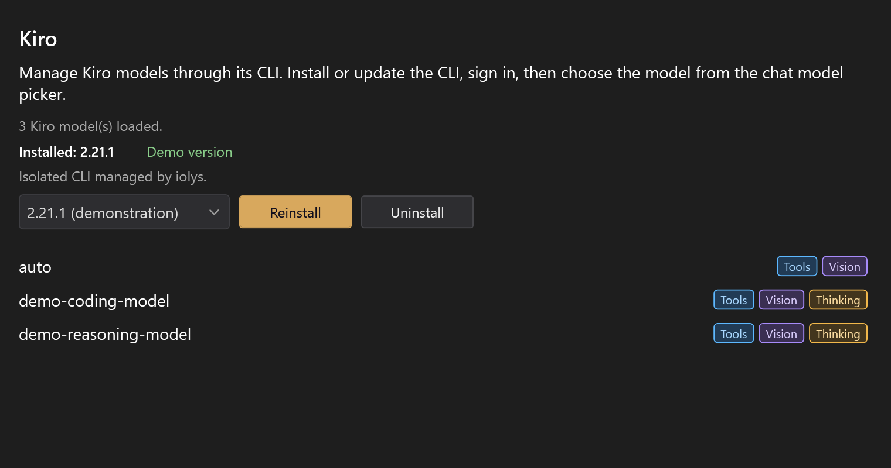
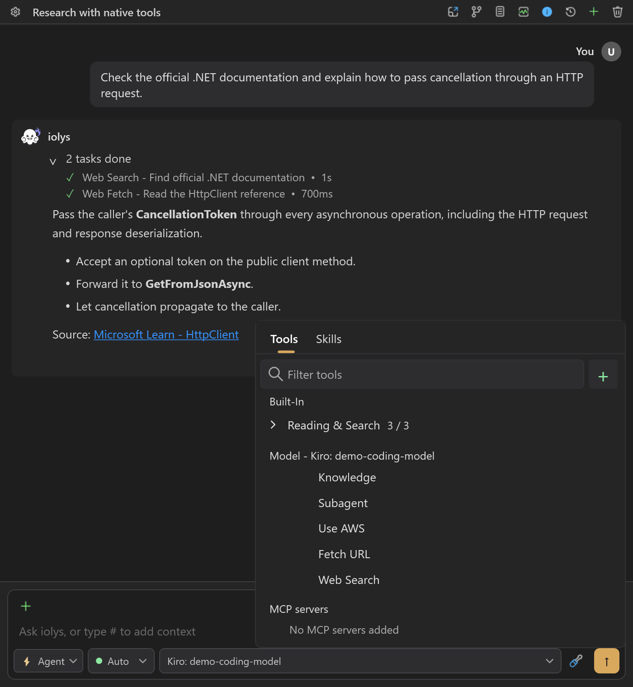
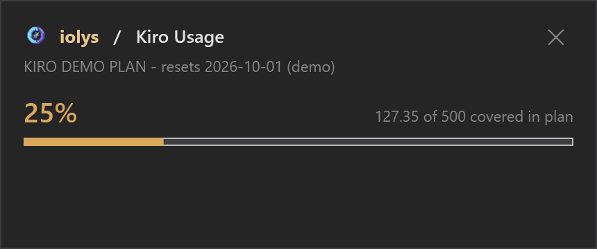

# Kiro

Use Kiro's managed CLI from iolys to work with your Kiro account, shared workspace tools, image attachments, and reported credits.

## Set up Kiro

1. Open **Manage Models**, select **Add Provider**, and choose **Kiro**.
2. Install Kiro CLI using the provider's version controls.
3. Sign in with the managed executable in PowerShell:

   ```powershell
   $kiroCli = Join-Path $env:LOCALAPPDATA 'Iolys\Providers\KiroCli\Cli\LocalApp\Kiro-Cli\kiro-cli.exe'
   & $kiroCli login
   & $kiroCli whoami
   ```

4. Complete Kiro's sign-in instructions, then return to iolys and select **Connect**.
5. Select a discovered model in Chat and send a message.

**Connect does not launch Kiro login.** It reconnects using existing CLI credentials. If the path above is absent, check the managed `Iolys\Providers\KiroCli\Cli` directory: older installations can place the executable directly there. A system CLI on PATH does not replace the managed executable.



*Illustrative models and versions.*

## Models and images

Use the model picker for current model and effort choices. Effort options can appear after capability discovery finishes. An unsupported or rejected effort blocks the prompt rather than silently applying a different value.

Attach images directly in the composer when **Vision** is available. Kiro's image capability comes from the live CLI connection. PNG, JPEG, GIF, BMP, and WebP are accepted locally, subject to file and encoded payload limits. The shared encoder can resize supported images for transport.

The iolys `read_image` tool is hidden for Kiro because this integration does not support image results from MCP tools. Attach the image itself rather than asking a tool to open it.

## Native tools and permissions

Kiro exposes five native tools: **Knowledge**, **Subagent**, **Use AWS**, **Fetch URL**, and **Web Search**. They cannot be disabled individually in the session picker. AWS operations still depend on your AWS configuration and permissions.



*Kiro's five native tools are listed without individual switches. The surrounding conversation is a demonstration.*

Shared [iolys tools](../customization/tools.md) follow your selected agent, mode, and [permissions](../customization/permissions.md). Native Kiro permission requests are a separate path and appear in the permission UI. **Plan mode restricts iolys tools but does not guarantee that every native Kiro action is read-only.** Review native requests accordingly.

Project [skills](../customization/skills.md) use the shared `.agents/skills` directory through a Kiro compatibility link. A real directory already occupying `.kiro/skills` is preserved and can prevent that link from being created.

## Usage and maintenance

Open **Usage** for the account's credit consumption, limit, plan, and reset label when reported. Completed turns can also show provider-reported credits. Credits are not dollars, and missing metering does not mean a free request. See [usage and context](../guide/usage.md).



*Compare consumed credits with the plan limit. This example uses a fictional plan and credit values.*

Update or reinstall from the managed version controls. Uninstalling this managed CLI does not sign out the normal Kiro profile or remove a separate system installation.

## Troubleshooting

| Problem | Action |
| --- | --- |
| Connect does not open a browser | Run the managed executable's `login`, verify `whoami`, then Connect. |
| No models appear | Verify sign-in, managed version, and connectivity; refresh the catalog. |
| Image tool is missing | Attach the image directly; `read_image` is intentionally unavailable. |
| Native tool checkbox cannot be changed | Those five tools have fixed inclusion in this integration. |
| Project skills are missing | Check for a conflicting `.kiro/skills` directory. |
