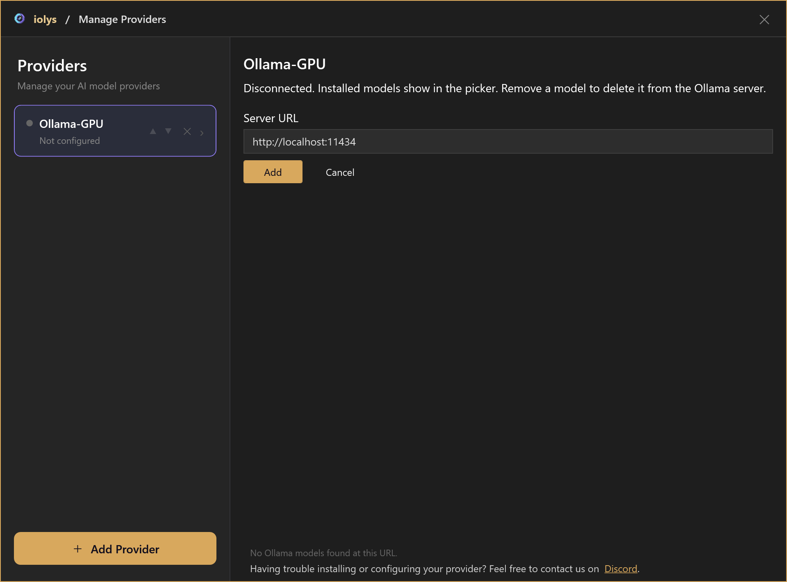
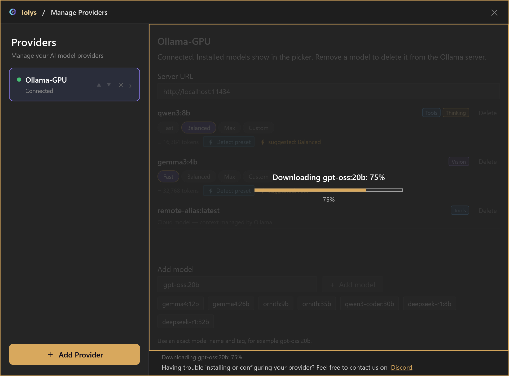
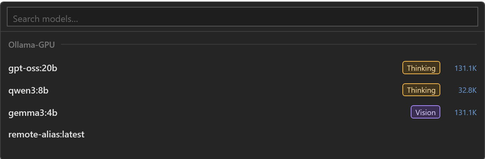
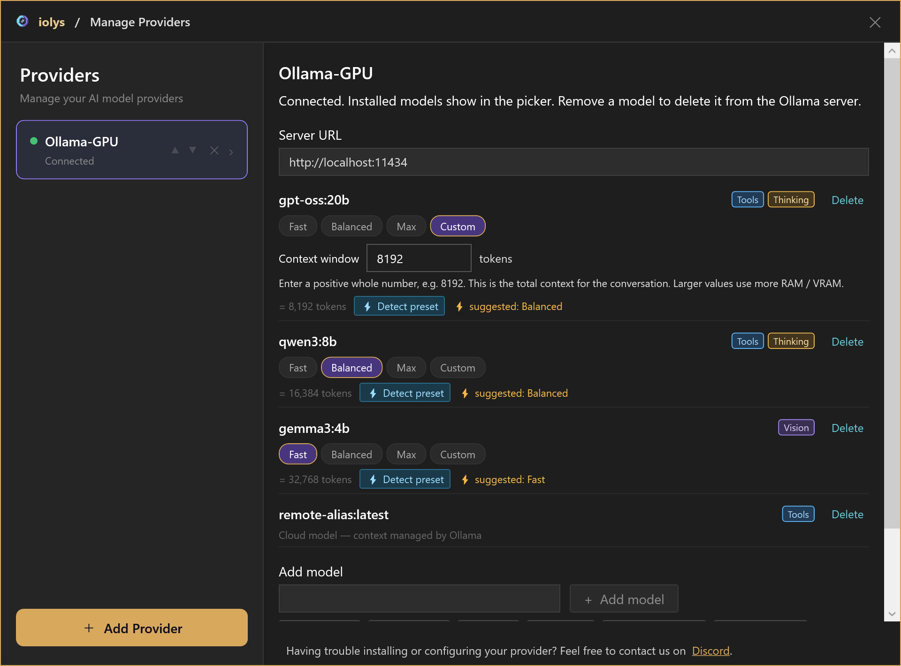
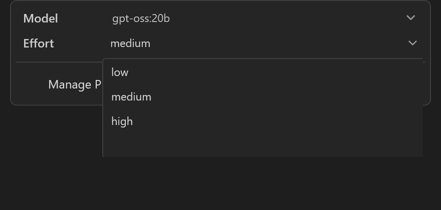
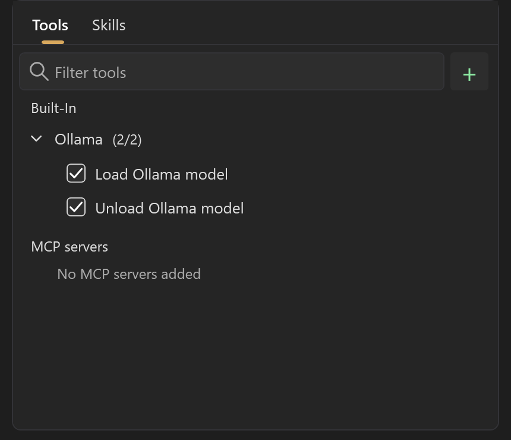
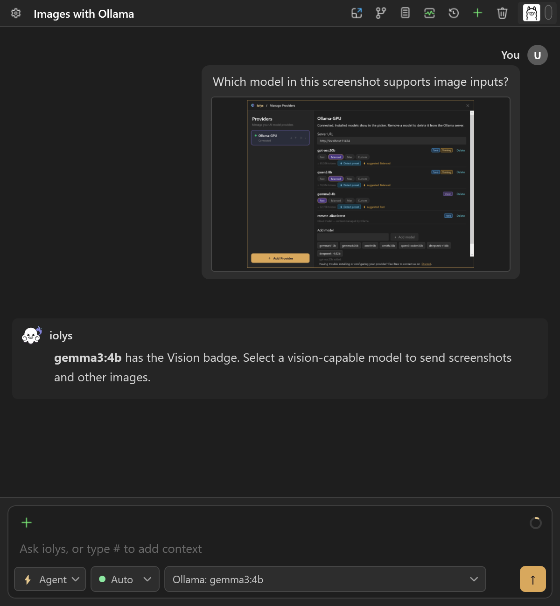
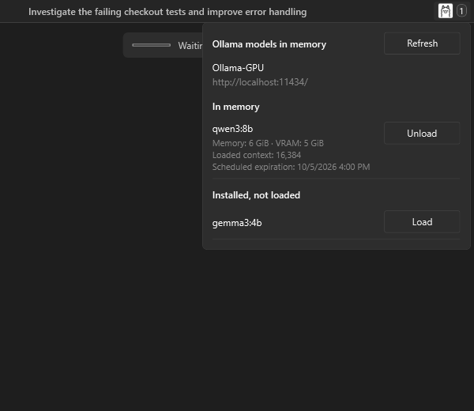
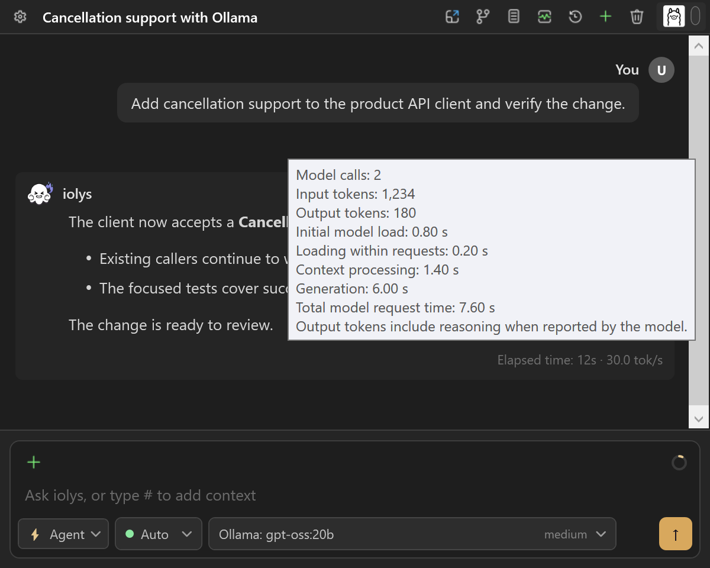
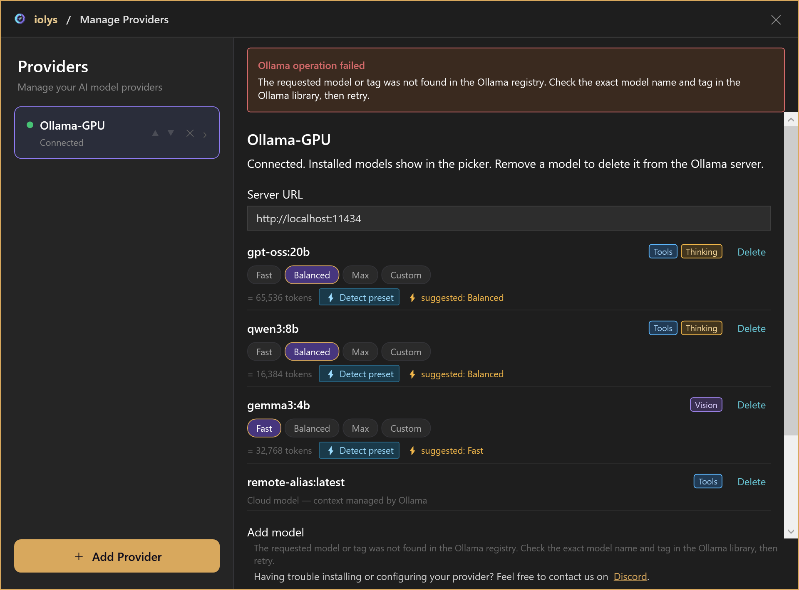

# Local AI for C# with Ollama in Visual Studio 2026

Bring local AI models into your C# development workflow in Visual Studio 2026 with Ollama and iolys. Connect to a local or remote Ollama server and install the models you want. You can adjust context and supported reasoning levels, inspect RAM / VRAM, load or unload models, and read generation performance from the chat window. Multiple named instances let you keep separate connections for different servers.

<a class="doc-button" href="https://marketplace.visualstudio.com/items?itemName=iolys.iolys-visual-studio">Install iolys for Visual Studio →</a>

## Connect a server

1. Install and start Ollama on the machine that will run inference.
2. Open **Manage Models** from the chat model menu, or **Settings > Manage Providers**. Select **Add Provider**, then **Ollama**.
3. Enter an **Instance name** and **Server URL**. The local default is `http://localhost:11434`.
4. Select **Create** and wait for the model list. Ollama does not require an API token in this form.

If the selected provider panel still shows a connection form, enter its **Server URL** and select **Add**.

*All screenshots on this page use the dark theme and demonstration data. Model names, capabilities, context sizes, memory values, conversations, and timings illustrate the interface.*

For a remote server, use an address reachable from the machine running the iolys server. The provider connects to an existing Ollama service; adding it does not install or start a remote service for you.

## Install and choose models

Enter an exact model name and tag under **Add model**, or choose a suggested model button. Select **Add model** to download it on the connected server.

The overlay shows each installation stage: pulling the manifest, downloading, detecting the context preset, and refreshing installed models. A download percentage covers the current transfer. Multi-layer downloads can start a new transfer, and **100%** can be followed by verification or context detection before installation finishes.

*Example download progress. Wait for context detection and catalog refresh before selecting the installed model.*

Return to Chat and open the model menu. Search by model or provider name, then select an installed model. The picker shows advertised thinking and vision support and a context limit when available. The provider panel also shows **Tools**, **Vision**, and **Thinking** badges and marks loaded models as **Running**.

*Example installed models for the Ollama-GPU instance. Use the current catalog to check capabilities.*

**Delete** removes a model's installed files from that server and refreshes the model list and picker. If you only want to free memory, use [Unload](#inspect-ram--vram) instead. Server changes can affect other applications using the same Ollama instance.

## Choose a context size

Local models offer four context presets. These control the total conversation allocation, independently of reasoning effort.

| Preset | Use |
| --- | --- |
| **Fast** | A smaller context window to reduce RAM / VRAM use. |
| **Balanced** | A larger allocation between Fast and Max. |
| **Max** | The model's reported maximum context. |
| **Custom** | An explicit positive whole number of tokens, such as `8192`. |

The token count below the presets shows the effective setting. **Detect preset** probes the model and suggests a setting for available memory; installation also runs this detection. Start with the suggested preset and reduce the allocation if loading fails or performance becomes unsuitable. Larger windows use more RAM / VRAM.

*Example custom allocation. The suggested preset and token counts depend on the model and server.*

Cloud models and remote aliases show **Cloud model — context managed by Ollama**. They have no local context presets or detection controls and are excluded from the local memory panel. A local Ollama model on another machine can still use local-model controls on that server.

The context view shows conversation consumption using the configured allocation. See [usage and context](../guide/usage.md).

## Set reasoning effort

Open the composer's model configuration menu and choose **Effort** when the selected model exposes named reasoning levels. The illustrated GPT-OSS model offers **low**, **medium**, and **high**, with **medium** as its default. Use the choices shown for your model.

*Example GPT-OSS effort selector. The context preset remains a separate setting.*

The **Thinking** badge alone does not guarantee an Effort selector. Models with only on/off thinking support have no named levels. On older Ollama versions without level metadata, thinking-capable GPT-OSS models can still offer these three choices. Returned reasoning streams separately from the answer and appears in an expandable **Thought** section. See [reasoning and speed](reasoning.md).

## Use tools and images

Choose a model with **Tools** support for development actions. Shared [iolys tools](../customization/tools.md), [MCP tools](../customization/mcp.md), and [skills](../customization/skills.md) remain subject to the selected agent, task configuration, and [permissions](../customization/permissions.md).

To enable model memory tools, open the tool picker and expand **Tools > Built-In > Ollama**.

| Tool | Action |
| --- | --- |
| `ollama_load_model` | Load an installed local model into RAM / VRAM. |
| `ollama_unload_model` | Release a local model from memory while keeping its installed files. |

Both accept an optional model name and use the current model when it is omitted. They do not install models and are unavailable for cloud models.

*Enable the memory tools if the agent needs to manage installed models.*

Select a **Vision** model before attaching a screenshot or another image. A model name alone does not establish image or tool support. See [files, images, and context](../guide/context.md) for attachment steps.

*Demonstration image input with a vision-capable model.*

## Inspect RAM / VRAM

Select the **Ollama icon in the chat header** to inspect the active conversation's provider instance. Its badge counts local models currently in memory. The popup separates:

- **In memory**: model name, memory, VRAM, loaded context, scheduled expiration, and **Unload**.
- **Installed, not loaded**: downloaded local models with a **Load** button.
- **Refresh**: update the server's current memory state.

*Example memory state. Unload frees RAM / VRAM; the model remains installed.*

Downloading and loading are separate operations. The panel can refresh while installation is running. iolys also preloads a local model before a turn. Manual loading, preloading, and local chat requests keep the model resident for **two hours after the last request**; **Unload** releases it immediately. Cloud models are excluded from the popup and its badge.

## Read generation performance

At the end of an Ollama turn, the footer can show elapsed time and generation speed in **tokens per second**. Hover over it to inspect input and output tokens, model-call count, context processing, loading, and generation times. Initial preloading is listed separately from loading within chat requests.

*Demonstration metrics: 180 output tokens over six seconds of generation give 30.0 tok/s across two model calls. These values are not a hardware benchmark.*

The generation rate combines completed model calls, including tool continuations. Tool execution contributes to elapsed turn time, so it can exceed generation time. Missing metrics stay hidden, and performance information remains available in session history. Actual performance depends on the model and server hardware.

Ollama has no provider subscription **Usage** view or monetary cost estimate in iolys. See [usage and session statistics](../guide/usage.md) for the other conversation counters.

## Troubleshooting

Failed installations leave a visible error banner above the model list and keep the entered name for correction. Fix the reported problem, then choose **Add model** again. The next operation clears the previous error.

*Example missing-model error. Check the exact name and tag before retrying.*

| Problem | Action |
| --- | --- |
| Cannot load the model list | Confirm Ollama is running and the server URL is reachable; use Retry. |
| The list is empty | Add a model and wait for its download to complete. |
| Loading fails or inference is slow | Check available server memory, choose a smaller model, or reduce the context preset. |
| Model or tag is not found | Correct the exact name and tag; for example, `gpt-oss:20b` includes the final `b`. |
| A model download fails | Check the Ollama server's disk space, file permissions, and connectivity to the registry. |
| Download succeeds but context detection fails | Keep the downloaded model and choose its context size manually. |
| No Effort selector appears | The selected model may not advertise named reasoning levels. A Thinking badge alone is insufficient. |
| Images fail | Select a model reporting Vision support. |
| Tool calls fail | Verify model tool support and the selected iolys tools; try a small focused task. |
| Memory information is unavailable | Check the active instance's connectivity and use Refresh. Unavailable data does not mean no models are loaded. |

To use your Ollama models in Visual Studio, [install iolys](../guide/installation.md) and try the [quickstart](../guide/quickstart.md) once a model is available.

## Get help

Share feedback about Ollama, ask setup questions, or suggest improvements: [join us on Discord](https://discord.com/invite/NMnFZmPsc5).
