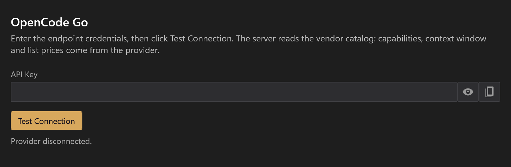
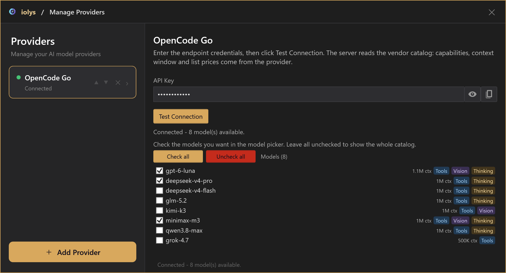
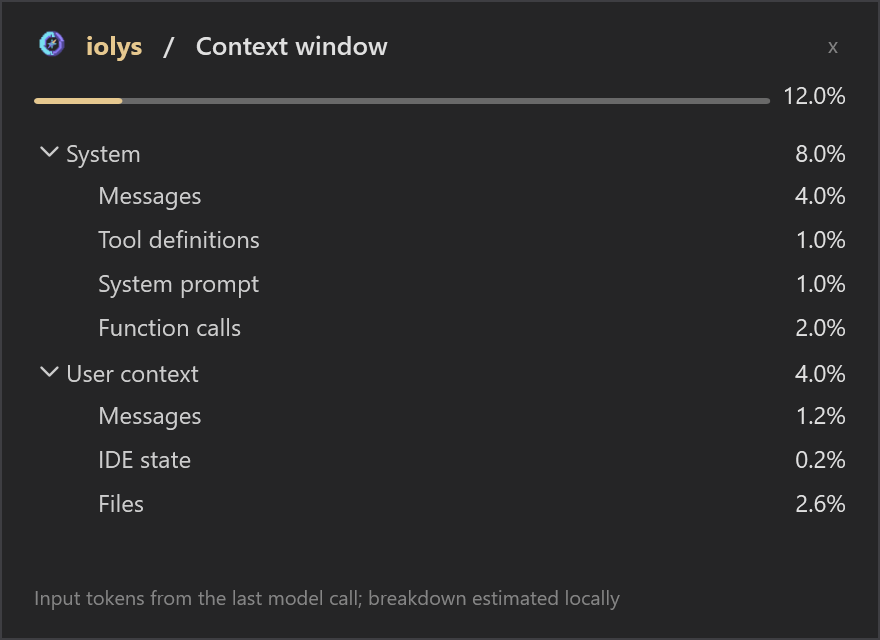
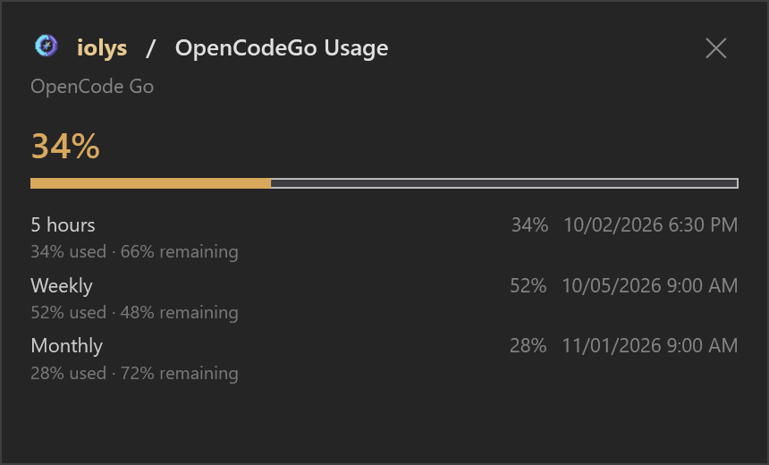

# C# development with OpenCode Go in Visual Studio 2026

Use your OpenCode Go subscription for C# development in Visual Studio 2026 by connecting an OpenCode API key to iolys. The dedicated provider discovers the Go catalog and chooses the appropriate API route for each model, while you keep the same chat, development tools, and review workflow.

**Go is the subscription service.** OpenCode Zen is a separate pay-as-you-go service. This connection uses Go's catalog and endpoint; it does not configure a Zen pay-as-you-go account.

<a class="doc-button" href="https://marketplace.visualstudio.com/items?itemName=iolys.iolys-visual-studio">Install iolys for Visual Studio →</a>

## Set up the connection

1. Open **Manage Models** from the chat model picker, or **Settings > Manage Providers**.
2. Select **Add Provider**, then **OpenCode Go**.
3. Enter your OpenCode key in **API token**. **Get your API key** opens the OpenCode sign-in page if you need to obtain one.
4. Select **Create**.
5. In the provider panel, use **Test Connection** to verify the connection and refresh available models. The saved credential is managed through **API Key**.
6. Return to Chat and choose an OpenCode Go model.

The endpoint is preset to `https://opencode.ai/zen/go/v1`; you do not need to enter a base URL or install a coding-agent CLI. An existing custom OpenAI-compatible connection remains separate. Select the dedicated **OpenCode Go** provider to use its routing, reasoning controls, and Usage view.

*All screenshots on this page use demonstration data. Catalogs, models, context sizes, and quota values illustrate the interface.*

## Choose models and capabilities

The provider panel lists discovered models, their known context windows, and capability badges. Check the models you want in the chat picker. Leaving all unchecked shows the whole catalog; **Check all** and **Uncheck all** change that selection together.

Use **Tools** for models that can perform development actions and **Vision** for image input. **Thinking** describes reasoning support; it does not necessarily provide an adjustable effort selector.

Go's model endpoint takes priority for reported limits and capabilities. iolys supplements it with public models.dev metadata and bundled fallbacks. The public metadata request carries neither your Go key nor the conversation ID. A temporary metadata failure does not by itself prevent connecting to Go. Consult the refreshed catalog instead of treating an illustrated model list as permanent.

## Set reasoning and use tools

Select reasoning effort in the **chat model picker**, rather than the connection panel. Options depend on the chosen model: some expose several effort levels, some offer `none` and `thinking`, and others have no selector. Use the values shown for that model. Where `none` is supported, it explicitly disables thinking; a missing selector leaves the model's server-side reasoning behavior in place.

Tool-capable models can use shared [iolys tools](../customization/tools.md), [MCP servers](../customization/mcp.md), and [skills](../customization/skills.md). Their availability still depends on the selected agent, mode, and [permissions](../customization/permissions.md). Attach images only to a model reporting Vision support. See [Files, images, and context](../guide/context.md) for the attachment workflow.

## Read context and output limits

**Context window usage** uses the input-token count reported by the last model call when available, with a locally estimated breakdown. Otherwise, it estimates the active conversation. Unknown model context limits remain unavailable rather than receiving a default size. OpenAI-protocol estimates exclude image and encrypted-reasoning tokens.

Each model call has an automatic output ceiling: the smaller of the model's models.dev output limit and **32,000 tokens**. Missing or invalid output limits fall back to 32,000. This ceiling is independent of reasoning effort and applies to each model call, not the whole conversation.

## Check account usage

Open **Usage** in Chat to see reported **5-hour**, **weekly**, and **monthly** consumption, remaining percentages, reset dates, and reached-limit warnings.

These counters cover the account, including requests from other clients. Missing counters mean unavailable data, not zero usage. The endpoint does not identify the Go/Go Plus plan or return a monetary balance, and iolys does not provide a Go per-turn dollar estimate. Context capacity and subscription quota measure different things; see [Usage and session statistics](../guide/usage.md).

## Troubleshooting

| Problem | What to check |
| --- | --- |
| Create stays disabled | Enter a nonempty API token. |
| Connection or authentication fails | Check the saved Go key and account access, then use Test Connection. |
| Expected models are missing | Refresh the connection and review the checked models in the provider panel. |
| No reasoning selector appears | The selected model may not expose configurable effort levels. |
| Images or tools fail | Check model capability badges, tool enablement, and agent restrictions. |
| A request reaches a limit | Open Usage and inspect the affected quota window and reset date. |
| Context details are unavailable | The model may have no known context limit or no reported input-token count yet. |

For metered requests, use the separate [OpenCode Zen provider](opencode-zen-visual-studio-2026.md). Zen estimates costs from returned tokens when its prices are known; Go reports subscription allowances.
