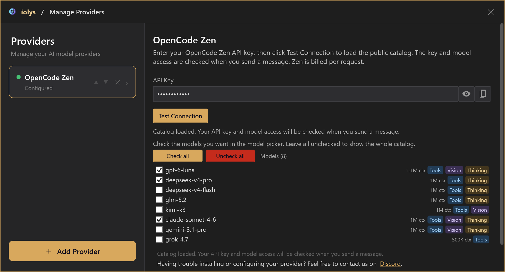
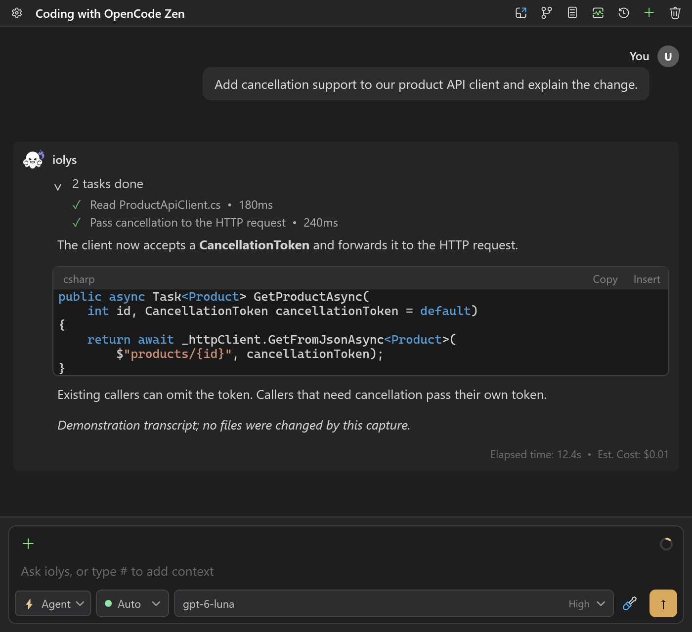

# OpenCode Zen for C# in Visual Studio 2026

Choose from OpenCode Zen's curated coding models for your C# projects in Visual Studio 2026 with iolys and your own API key. Zen bills requests through your OpenCode account. [OpenCode Go](opencode-go-visual-studio-2026.md) is a separate subscription connection; each provider has its own settings and model selection.

<a class="doc-button" href="https://marketplace.visualstudio.com/items?itemName=iolys.iolys-visual-studio">Install iolys for Visual Studio →</a>

## Connect and choose models

1. Sign in to the [OpenCode Console](https://opencode.ai/auth), configure billing, and obtain an API key.
2. Open **Manage Models**, choose **Add Provider > OpenCode Zen**, and enter the key.
3. Run **Test Connection** to load the public catalog. The panel says **Catalog loaded** and the card says **Configured**. This does not validate the key, credits, or access to a specific model; the first message checks those.
4. Check the models to include in your chat picker. With no models checked, all supported discovered models appear.
5. Choose the model and any available reasoning effort beside your prompt.

The endpoint is fixed at `https://opencode.ai/zen/v1`. No OpenCode CLI is required. Keep Go and Zen as distinct providers even if your account supplies the same key. Stored credentials use the existing Windows credential protection.

*Product controls rendered with demonstration data. These captures show no live account, credential, or billed request.*

## Capabilities and reasoning

The catalog shows tool, image, reasoning, and context capabilities when known. Image input requires a Vision model. Reasoning controls appear only for verified model profiles; a Thinking badge does not guarantee adjustable effort. Without an explicit selection, iolys leaves the provider's reasoning default in place.

Tool-capable models use the same iolys and MCP tools, skills, agent selection, permission checks, cancellation, and review workflow as other providers. Zen does not automatically enable provider-native web search or code execution. Gemini uses its native streaming protocol and preserves thought signatures during the active conversation. The Gemini loop is limited to 50 model calls per turn.

The integration selects Responses, Chat Completions, Messages, or native Gemini from an exact verified model table. An unrecognized model is omitted until its route is verified. Free-tier models, including Big Pickle and `-free` variants, are excluded because their access is restricted to the OpenCode client. Adding Zen credit does not make those variants available in iolys. System One/Jev structured decisions are outside the chat scope. Refresh the catalog if an existing selection disappears, then explicitly select another model.

## Token usage and estimated costs

Returned token usage is collected independently of account quotas and prices. When valid pricing exists for the exact model in the public **OpenCode Zen** catalog, iolys estimates each call's USD cost, including applicable cache rates and context tiers. It never substitutes direct Anthropic or Google prices. Output reasoning tokens are counted once; streaming usage snapshots are not added together.

Turn and session amounts are **sums of available cost estimates**. Calls with missing usage, missing rates for a reported cache bucket, or an unsupported pricing tier are excluded from the amount. A missing estimate does not mean the request was free. Provider fees, taxes, BYOK terms, and billing adjustments are not included. Check the OpenCode Console for authoritative charges.

Zen has no account Usage view in iolys: its public API does not document a balance or quota endpoint for this integration. This is separate from the token usage returned by model calls. Go's five-hour, weekly, and monthly allowance display does not apply to Zen.

Context usage uses input tokens from the **last model call**, with a locally estimated category breakdown. It does not sum the prompts of every tool-loop call. Unknown context sizes remain unavailable. Output is capped at the smaller of the known model output limit and 32,000 tokens per call, or 32,000 when unavailable.

## Resume and troubleshoot

Active conversations preserve transport-specific tool and reasoning state. Reloaded conversations and changes between protocols use the existing text-only history replay: old images, tool executions, signatures, and encrypted reasoning are not restored or re-executed. Persisted monetary totals remain sums of available estimates.

- **Catalog loads but a message fails:** check the key, credits, workspace/model access, and account limits in the OpenCode Console. Catalog discovery is public.
- **HTTP 401:** read the gateway's actual error. It can describe an authentication, billing, or account restriction.
- **HTTP 429:** check the declared rate or account limit before retrying. Partial output and completed tool activity are never silently replayed.
- **Missing model:** refresh the catalog; free-tier models (including Big Pickle), unknown protocols, and System One models are excluded. Existing missing selections require a new explicit selection.
- **Missing estimate:** usage or the required Zen prices may be unavailable. Public metadata is cached for 24 hours; failed refreshes retry after 15 minutes. Metadata requests carry no key or conversation identifier.

Sources checked October 4, 2026: [Zen documentation](https://opencode.ai/docs/zen/), [Zen catalog](https://opencode.ai/zen/v1/models), [models.dev](https://models.dev/api.json), and [OpenCode routing/transformations](https://github.com/anomalyco/opencode/tree/907b3bc518fa48e90e8ec24dd327d13eee71c36c/packages).
