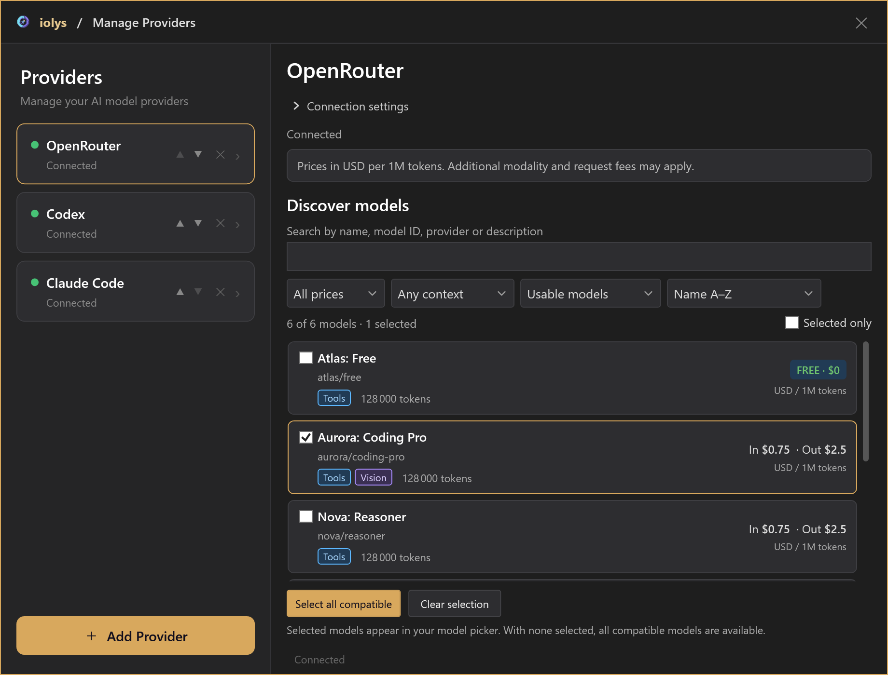
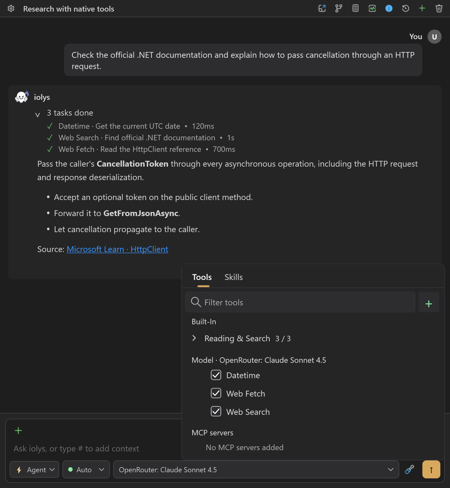
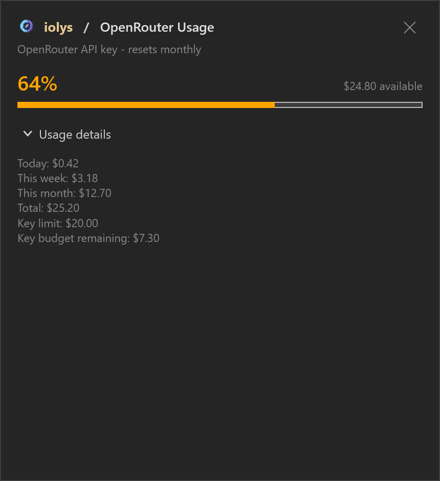

# OpenRouter models for C# in Visual Studio 2026

Choose models from multiple vendors for your C# projects in Visual Studio 2026 through iolys and one OpenRouter API key. Your catalog depends on your OpenRouter account. Filter models by price, context size, and capabilities, then pin the ones you use.

<a class="doc-button" href="https://marketplace.visualstudio.com/items?itemName=iolys.iolys-visual-studio">Install iolys for Visual Studio →</a>

## Set up OpenRouter

1. Obtain an API key from your OpenRouter account.
2. Open **Manage Models**, select **Add Provider**, and choose **OpenRouter**.
3. Enter the key and select **Create** to validate the connection and add the provider.
4. Select **Test Connection** to refresh the connection and catalog.
5. Select the models to show in the conversation picker, then return to Chat.

The endpoint is preset to `https://openrouter.ai/api/v1`. For an existing connection, expand **Connection settings** to update the key. Use a model with tool support for iolys development tasks.

*Demonstration models and prices.*

## Find and select models

Search matches model names, IDs, and descriptions. Filter by **Free** or **Paid**, minimum context size, and tool compatibility. Sort by name, input price, output price, context size, or newest entry.

Cards show capabilities, context size, and input/output prices per million tokens. These prices exclude some image, request, and native-tool charges.

A card's checkbox pins it to the conversation picker. **Select all compatible** and **Clear selection** change pins in bulk. With no models selected, all compatible available models are shown. Filtering the discovery view does not unpin hidden models.

## Credit eligibility

iolys checks account credit and key limits during discovery. If the key is restricted to free usage, the key budget is exhausted, or account credit is depleted, only free models are retained. If account credit cannot be verified, discovery also limits the catalog to free models and invites you to test again.

After changing credits or key limits, run **Test Connection** again. Free models still have usage limits. **No matching models** means filters exclude the results; **No eligible models available** means no selectable catalog entries remain.

## Attach images

Choose a **Vision** model to attach an image. Supported local input formats are PNG, JPEG, GIF, and WebP, with a **20 MiB per-file limit**. Invalid or unreadable files can be skipped while the text message is still sent, so check the response and diagnostics if the image was not considered.

## Configure reasoning

Select an available effort in the conversation model picker. Choices and defaults come from model-specific reasoning metadata; generic reasoning support alone does not enable a selector. A model requiring reasoning does not offer `none`.

After switching models, review the available choices. Unsupported or unset effort values are omitted from the request. See [reasoning and speed](reasoning.md).

## Use native tools

Tool-capable models expose these controls under **Model Tools**:

| Tool | Purpose |
| --- | --- |
| **Web Search** | Search for current information. |
| **Web Fetch** | Read a web page. |
| **Datetime** | Obtain the current UTC date and time. |

Enable or disable each independently. They remain subject to custom-agent tool selection in both Agent and Plan modes. Enabling a tool makes it available; the model decides whether to use it. OpenRouter executes these tools, and additional charges may apply.

Shared [workspace tools](../customization/tools.md) and [MCP tools](../customization/mcp.md) use their own [permissions](../customization/permissions.md). A native web tool does not grant local file access.

*Demonstration conversation and tool activity.*

## Usage and costs

Open **Usage** to compare available **account credit** with spending for the **configured API key**. The details can show daily, weekly, monthly, and total spending, a key budget, and reported bring-your-own-key usage. This view reports BYOK usage; it does not configure BYOK.

Budget progress measures the key's spending limit, not the account balance. A key can exhaust its budget while the account still has credit. An unlimited key can also belong to an empty account. Reset labels identify a period, not an exact reset time. **Unavailable** does not mean zero.

*Demonstration account values and budget.*

Conversation **Est. Cost** accumulates API-reported amounts across model calls; it does not multiply model-card prices. Missing reporting can leave totals incomplete, and an absent amount does not prove a free request. Conversation totals are separate from account billing.

## Integration limits

This provider targets text conversations with optional image input. It does not expose image generation, audio, video, routing preferences, fallback chains, or server-tool budgets. Only the three native tools above are enabled by this integration.

## Troubleshooting

| Problem | Action |
| --- | --- |
| Paid models are missing | Check account credit and the key's spending limit, then test again. |
| The model picker is too large | Pin the models you want in Manage Models. |
| No results match | Clear search and filters before checking connection eligibility. |
| No effort choice appears | Choose a model whose catalog advertises effort levels. |
| Costs differ from expectations | Compare reported account Usage; token-card prices exclude some possible charges. |

See [usage and context](../guide/usage.md) for interpreting session statistics.
