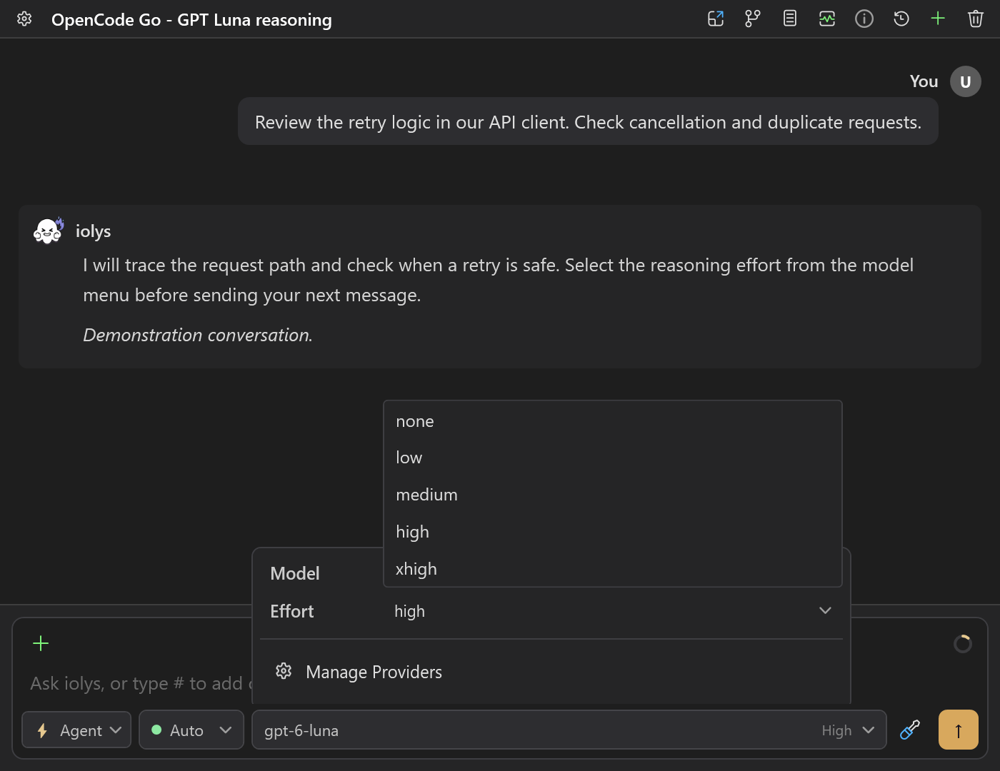
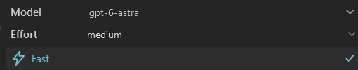

# Reasoning and speed

The model picker can expose extra controls for reasoning effort and speed. These controls are specific to the selected provider and model. A missing selector usually means the model has not advertised that capability.

## Choose a reasoning effort

1. Open the model picker in the conversation composer.
2. Select the provider and model you want to use.
3. If a reasoning-effort row appears, select one of its available levels.
4. Send your next message with that configuration.

*Example effort selector for an OpenCode Go model. Demonstration choices illustrate the control; other models can offer different levels.*

Use the provider's default while learning how a model behaves. A higher effort can help with a difficult investigation, but may increase response time and token use. Effort names are provider settings, not a comparable measure of quality across different models.

The selection belongs to the conversation. When switching to a model without effort options, iolys clears or ignores an incompatible previous selection instead of sending an unsupported value.

## Availability by provider

| Provider | How effort is offered |
| --- | --- |
| [Claude Code](claude-code.md) | Available controls depend on the managed CLI and selected model. |
| [Codex](codex.md) | The CLI advertises supported effort levels for each model. |
| [Kimi](kimi.md) | Uses the model catalog and the CLI's current configuration options. An on/off thinking control is different from graded effort. |
| [Kiro](kiro.md) | Discovers the model's effort options through the CLI. Discovery can finish after the model list first appears. |
| Anthropic API | Sends effort only when supported by the selected model. |
| [DeepSeek](deepseek.md) | Offers the effort choices supported by the current integration's catalog. |
| [OpenRouter](openrouter.md) | Uses reasoning metadata from its model catalog; not all models offer a selector. |
| [OpenCode Go](opencode-go.md) | Uses model-specific effort options. |
| [Databricks](databricks.md) | Depends on the endpoint's model profile and transport. |

The generic OpenAI-compatible integration, Google, Groq, NVIDIA NIM, and Ollama do not expose this shared effort control in the current implementation. Reasoning text may still be displayed where a provider supplies it; that does not imply a configurable effort level.

## Select a speed tier

When a provider advertises accelerated service tiers, the composer offers a speed choice. Codex reads these choices from its CLI model catalog.

New conversations start on standard service. An accelerated tier is an explicit session choice; it does not become the default for all provider connections. Availability, usage rules, and billing depend on your provider account.

*Codex Fast selected independently of reasoning effort. This release screenshot illustrates the controls, not current model availability.*

If the provider rejects the requested tier, the turn fails and iolys resets the next turn to standard. It does not automatically replay a turn that might already have performed actions. Read the error, review any completed work, and retry deliberately.

## Resolve missing or rejected options

- **No effort selector:** choose a model that reports effort support. Do not assume support from its name alone.
- **Kiro options appear late:** reopen the composer configuration after model discovery finishes.
- **Kimi reports incompatible levels:** update the managed CLI and refresh the model catalog.
- **An old conversation rejects a choice:** select a currently advertised value, or return to the default.
- **An accelerated tier is rejected:** check the provider's account eligibility and use standard service for the next attempt.

See [Usage and costs](../guide/usage.md) to interpret the resulting token, quota, and cost information.
