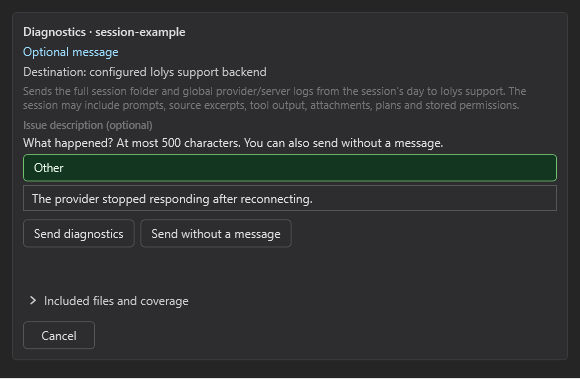

# Data and privacy

iolys runs a local companion server, but using a local interface does not mean every operation stays on your computer. Data destinations depend on your selected model provider, enabled tools, connected MCP services, and iolys backend reporting.

## Model requests and connected tools

Your chosen provider receives the context needed for the conversation: messages, applicable instructions, attached content, and tool results. An agent reading a source file can include that file's contents in the model request. Cloud providers, remote Ollama servers, and MCP services have their own handling and retention policies.

A local Ollama endpoint can keep model inference on that machine, but other enabled services and iolys analytics may still use the network. Choose endpoints and tools according to your project's requirements.

IDE attachments are explicit. An active-document attachment shares the file reference and display name, while a selection attachment can include the selected text, including unsaved content. Removing a chip stops its proactive inclusion in the next message; it does not disable the agent's file-reading tools.

## Local storage and credentials

Conversations and their artifacts are stored under:

```text
<solution-root>\.vs\iolys\sessions\V3\
```

Session folders can contain messages, tool output, attachments, plans, logs, and permission decisions. Other user-level data is stored under `%LOCALAPPDATA%\Iolys`. Treat local session data and backups as project-sensitive information; do not commit them to a public repository.

Provider API keys saved through iolys settings use Windows DPAPI in the current-user scope. MCP secret values are also protected in local configuration. This protection applies to those stored credentials, not to every conversation, attachment, or log. Managed CLIs maintain their own authentication state.

Workspace skills and agent definitions are intended to be reviewable project files. Keep credentials out of their Markdown and scripts. Solution-level MCP configuration is shareable, but user-bound protected values are not portable credentials.

## Automatic enrollment and analytics

Release builds automatically enroll with `api.getiolys.com` and report usage snapshots while the companion server runs. Initial enrollment requires an active Visual Studio connection; subsequent reporting can continue without an open IDE.

Reported information includes:

- iolys and Visual Studio versions, project names, and opaque identifiers for projects, workspaces, and sessions.
- Daily accepted-prompt counts by provider and model, and enabled provider types.
- Windows domain and Entra membership observations, including domain name or tenant ID/name when available.

The analytics payload excludes prompt text, source contents, filesystem paths, Git URLs, conversation titles, and user-defined provider configuration names. Deleting a conversation or worktree does not remove previously accumulated analytics totals.

Administrators can disable backend enrollment/reporting for a server process with `BackendEnrollment__Enabled=false`. This is a server configuration setting, not a chat permission switch; apply it to the companion server's environment before startup. It does not disable external model requests or MCP connections.

## Diagnostic reports

`/send_diagnostics` opens a report card for the selected session. Review the destination and choose **Send diagnostics**, **Send without a message**, or **Cancel**.



*The report card identifies the destination and lets you inspect Included files and coverage before sending. Example data.*

The archive includes the complete captured session folder and selected diagnostic logs. It can contain prompts, source excerpts, attachments, plans, tool output, and permission decisions. Supplemental logs are redacted, but that is not a promise to remove sensitive content from the original session files.

There is no automatic session-diagnostics submission. **Sent** confirms remote receipt and provides a support code and expiration. Cancelling cannot retract data already accepted; dismissing the card only closes it.

Use [permissions](../customization/permissions.md) and [tool selection](../customization/tools.md) to control future agent actions. These controls do not change the retention policies of external services or revoke data already sent.
